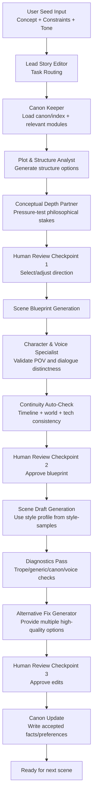

# AI Co-Author System Design Doc

## Purpose
Define the end-to-end technical and workflow design for an opinionated AI co-author system that assists fiction writing (especially SF-Thriller and SF-Philosophical), while preserving human creative control.

## Design Goals
1. Generate strong options for plot, character, and scene development.
2. Detect problems proactively (continuity, weak causality, generic dialogue, trope drift).
3. Draft in the writer's style using user-provided samples.
4. Keep a single canonical source of truth with long-term preference learning.
5. Pause for human approval at major checkpoints.

## Architecture Components
- **Lead Story Editor (Orchestrator)**: Routes tasks, coordinates specialists, presents decisions.
- **Plot & Structure Analyst**: Story engine, causality, tension and reversal checks.
- **Character & Voice Specialist**: Character consistency, dialogue distinctness, stereotype checks.
- **Continuity & Canon Keeper**: Canon integrity, timeline, factual consistency.
- **Conceptual Depth Partner**: Philosophical stakes and thematic pressure.
- **Prose & Rhythm Crafter**: Draft fluency and line-level rhythm improvements.

## Data Model
Canonical memory lives under `canon/`:
- `index.md`: canonical registry and change log
- `timeline.md`: ordered events and constraints
- `preferences.md`: confirmed preference updates
- `characters/`, `world/`, `tech/`, `themes/`: scoped modules
- `style-samples/`: minimum 3 user-authored style passages

## System Flow Diagram


## Stage Logic
### Stage 0: Intake
- Receive story seed and constraints.
- Retrieve relevant canon context.
- Produce multiple direction options.

### Stage 1: Planning
- Build/adjust plot spine and scene blueprint.
- Validate philosophical pressure and character intent.

### Stage 2: Drafting
- Generate prose in user's style profile.
- Ensure POV consistency and pacing.

### Stage 3: Diagnostics
- Run continuity, trope, and quality checks automatically.
- Produce actionable alternatives per issue.

### Stage 4: Commit
- Apply accepted changes.
- Update canon modules and preferences for long-term learning.

## Guardrails
- No implicit canon changes: every material update is explicit.
- No silent preference drift: major preference changes require confirmation.
- No automatic branch explosion: "what-if" branches only on explicit request.
- No finalization without human checkpoint approval.

## Operational Validation
Use deterministic validation before major runs:
```bash
python scripts/validate_coauthor_setup.py --root .
```

## Implementation Notes
- Keep retrieval bounded: load index + only relevant modules.
- Keep outputs structured: each stage produces explicit artifacts.
- Keep revisions auditable: canon updates should append concise change notes.
