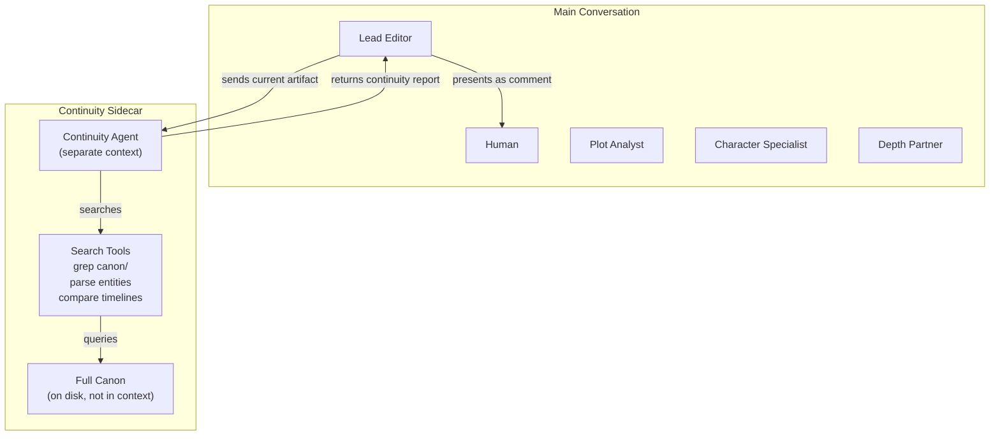

# Context Loading, Continuity Agent, and Model Routing

## The Blank Slate Problem

New conversation = zero context. The system needs a **bootstrap protocol** that tells the blank-slate AI exactly what to load and why.

### Solution: The Manifest File

When Phase 4 (Commit) closes a step, the Lead Editor writes not just the artifact but a **manifest** — a machine-readable instruction for the next conversation:

```yaml
# .pipeline-state.yaml (expanded)

position:
  level: 3              # act-outline
  act: 2
  chapter: null
  scene: null
  step_type: act-outline  # what skill/template applies

# === CONTEXT MANIFEST ===
# This section tells the NEXT conversation exactly what to load.

context_manifest:
  
  # ALWAYS load these (small, essential)
  system:
    - canon/preferences.md
    - .pipeline-state.yaml
  
  # Parent chain: walk up the hierarchy from current position
  parent_chain:
    - canon/story-concept.md        # Level 1 (always)
    - canon/story-arc.md            # Level 2 (always at L3+)
  
  # Current node (if resuming partial work)  
  current_node: canon/acts/act-2-outline.md  # null if new
  
  # Sibling context: previous sibling at same level
  sibling_previous: canon/acts/act-1-outline.md
  
  # Reference files relevant to this step
  reference:
    - canon/characters/marcus.md
    - canon/characters/elena.md
    - canon/world-rules.md
  
  # Continuity agent instructions (separate from main context)
  continuity_scope:
    search_entities:
      - marcus
      - elena
      - zone-3
      - prosthetic
    canon_root: canon/
    
  # Agent configuration for this step
  agents:
    lead_editor: { model: claude-sonnet, active: true }
    plot_analyst: { model: claude-sonnet, active: true }
    character_specialist: { model: claude-sonnet, active: true }
    depth_partner: { model: claude-sonnet, active: true }
    continuity_agent: { model: claude-haiku, active: true, tool_use: true }
    prose_crafter: { model: claude-sonnet, active: false }  # not needed at L3
```

### How the Manifest Gets Built

The manifest is **deterministic** — it follows rules based on position in the grid:

```
RULE 1: Always load system files
RULE 2: Parent chain = walk up from current level
  L5 (scene): load concept + arc + act-outline + chapter-outline
  L4 (chapter): load concept + arc + act-outline
  L3 (act): load concept + arc
  L2 (arcs): load concept
  L1 (concept): nothing above
RULE 3: Previous sibling = the node before this one at same level
  Act 2 → load Act 1 outline (for continuity)
  Ch 3 → load Ch 2 outline
  Sc 2 → load Sc 1 draft
RULE 4: Reference = characters mentioned in parent chain + world rules
RULE 5: Continuity entities = extract from parent chain + current node
```

A simple Python script can generate this manifest automatically:

```python
def build_manifest(pipeline_state):
    """Read pipeline-state, generate context manifest."""
    manifest = {}
    level = pipeline_state['position']['level']
    act = pipeline_state['position']['act']
    
    # Parent chain
    parents = ['canon/story-concept.md']
    if level >= 2: parents.append('canon/story-arc.md')
    if level >= 3: parents.append(f'canon/acts/act-{act}-outline.md')
    # ... etc
    
    # Extract entities from parent files for continuity agent
    entities = extract_entities(parents)
    
    manifest['parent_chain'] = parents
    manifest['continuity_scope'] = {'search_entities': entities}
    return manifest
```

### Conversation Bootstrap

When a new conversation starts, the **first message** is:

```
System: You are the Lead Editor for the Fiction Writing Pipeline.
Load your context from .pipeline-state.yaml, then follow the
context_manifest to load required files. Once loaded, announce
the current step and offer Phase 1 (Structure) or wait for
human input.
```

The AI reads the manifest, loads the specified files, and the session begins with exactly the right context — no more, no less.

---

## The Continuity Agent

### Why It's Different From Other Agents

The other agents (Plot Analyst, Character Specialist, etc.) work **within the main conversation** and see the same context. The Continuity Agent has a fundamentally different job:

| Dimension | Main Agents | Continuity Agent |
|-----------|-------------|-----------------|
| **Context** | Parent chain + current artifact | Searches full canon on demand |
| **Input** | Conversation flow | Current draft/artifact snapshot |
| **Method** | Reasoning about story craft | Entity extraction → search → compare |
| **Output** | Comments in the queue | Continuity report (pass/fail/flags) |
| **Cost** | Main model per comment | Cheap model + tool calls |
| **Conversation** | Full participation | Receive artifact, return report |

### Architecture: Sidecar, Not Participant



### How the Continuity Agent Works

**Step 1: Receive the current artifact**

The Lead Editor sends the current state of the artifact (e.g., Act 2 Outline) to the Continuity Agent as a standalone request — not the full conversation.

**Step 2: Extract entities**

The agent (or a script) extracts mentions from the artifact:

```python
def extract_entities(artifact_text):
    """Extract character names, locations, objects, 
    knowledge claims, timeline references."""
    entities = {
        'characters': [],   # names mentioned
        'locations': [],    # places mentioned
        'objects': [],      # significant items
        'knowledge': [],    # "X knows Y" claims
        'timeline': [],     # time references
        'rules': []         # world-rule-adjacent claims
    }
    # NLP extraction or pattern matching
    return entities
```

**Step 3: Search canon for each entity**

Instead of loading all canon into context, use targeted search:

```bash
# For each character mentioned in the draft:
grep -r "marcus" canon/ --include="*.md" -l
# Returns: characters/marcus.md, acts/act-1-outline.md, 
#          story-concept.md

# For knowledge claims:
grep -r "Elena.*knows\|Elena.*learned\|Elena.*discovered" canon/
# Check if the draft assumes Elena knows something she shouldn't

# For timeline:
grep -r "day 3\|third day\|night.*two" canon/
# Verify the draft's timeline matches established events
```

**Step 4: Compare draft against search results**

Load only the **relevant snippets** (not full files) into the agent's context and check:
- Does the draft contradict any established facts?
- Does any character know something they shouldn't at this point?
- Is the timeline consistent?
- Are world rules respected?
- Are objects/injuries tracked correctly?

**Step 5: Return a continuity report**

```markdown
## Continuity Report: Act 2 Outline

### ✅ Passes
- Marcus's prosthetic limitation is respected
- Elena's zone knowledge is consistent with Act 1
- Timeline follows Act 1 ending

### ⚠️ Flags
- Ch7 says "Marcus recognized the symbol from training" 
  but marcus.md has no military symbol training. 
  → Add to backstory, or change to Elena recognizing it?
  
- Ch8 places them at Zone 2 perimeter but Act 1 Ch5 
  established zones shifted. Is the old perimeter still valid?

### ❌ Violations
- Ch6 has Elena speaking to the guard in Spanish, but 
  elena.md specifies she speaks English and ASL only.
```

The Lead Editor presents this report as one item in the Comment Queue, and the human responds to each flag.

---

## Model Routing: Right Model for the Job

### Model Tiers

| Tier | Model Class | Cost | Strength |
|------|------------|------|----------|
| **Tier 1** (Heavy) | Claude Opus / GPT-4o / Gemini Ultra | $$$ | Deep reasoning, creative writing, nuanced analysis |
| **Tier 2** (Balanced) | Claude Sonnet / GPT-4o-mini | $$ | Good reasoning, solid craft analysis, fast |
| **Tier 3** (Light) | Claude Haiku / GPT-4o-mini / Gemini Flash | $ | Extraction, classification, search, formatting |

### Agent-to-Model Mapping

| Agent | Primary Task | Recommended Tier | Why |
|-------|-------------|-----------------|-----|
| **Lead Editor** | Orchestration, formatting, turn management | Tier 2 | Needs competence but not brilliance; runs most often |
| **Plot Analyst** | Structure analysis, causality, tension | Tier 2 | Needs Story Grid reasoning but on structured data |
| **Character Specialist** | Psychology, voice, motivation | Tier 1 or 2 | Nuanced character reasoning benefits from stronger model |
| **Depth Partner** | Philosophical stakes, thematic pressure | Tier 1 | Most "creative thinking" required; Tier 2 produces shallow takes |
| **Continuity Agent** | Entity search, fact cross-reference | **Tier 3 + tools** | Mostly mechanical; intelligence is in the search, not the reasoning |
| **Prose Crafter** | Line-level writing quality (L4-L5 only) | **Tier 1** | Creative writing quality directly correlates with model quality |

### Cost Impact

```
Typical mob session: 1 step, 2 rounds of comments

Without model routing (all Tier 1):
  Lead Editor:         4 calls × $0.03 = $0.12
  Plot Analyst:        2 calls × $0.03 = $0.06
  Character Spec:      2 calls × $0.03 = $0.06
  Depth Partner:       2 calls × $0.03 = $0.06
  Continuity Agent:    1 call  × $0.03 = $0.03
  Total: ~$0.33/step

With model routing:
  Lead Editor (T2):    4 calls × $0.01 = $0.04
  Plot Analyst (T2):   2 calls × $0.01 = $0.02
  Character Spec (T2): 2 calls × $0.01 = $0.02
  Depth Partner (T1):  2 calls × $0.03 = $0.06
  Continuity (T3+tools): 1 call × $0.002 + search = $0.01
  Total: ~$0.15/step

Savings: ~55% per step
Over a full novel (50 chapters × 3 scenes × 5 levels): significant
```

### Level-Based Routing

Not all agents are needed at every level:

| Agent | L1 Concept | L2 Arcs | L3 Act Outline | L4 Chapter | L5 Scene |
|-------|-----------|---------|----------------|-----------|---------|
| Lead Editor | ✅ T2 | ✅ T2 | ✅ T2 | ✅ T2 | ✅ T2 |
| Plot Analyst | ✅ T2 | ✅ T2 | ✅ T2 | ✅ T2 | ⬜ Off |
| Character Spec | ⬜ Off | ✅ T2 | ✅ T2 | ✅ T2 | ✅ T1 |
| Depth Partner | ✅ T1 | ✅ T1 | ✅ T2 | ⬜ Off | ⬜ Off |
| Continuity Agent | ⬜ Off | ⬜ Off | ✅ T3 | ✅ T3 | ✅ T3 |
| Prose Crafter | ⬜ Off | ⬜ Off | ⬜ Off | ⬜ Off | ✅ T1 |

This means:
- At L1 (Concept): 3 agents active, cheapest config
- At L5 (Scene): 4 agents active, 2 at Tier 1 for creative quality
- Continuity Agent only activates at L3+ where cross-node consistency matters

---

## Continuity Across Acts: The Handoff

When the user finishes Act 1 and navigates to Act 2, here's exactly what happens:

```mermaid
sequenceDiagram
    participant H as Human
    participant LE1 as Lead Editor (Act 1 session)
    participant FILES as Canon Files
    participant LE2 as Lead Editor (Act 2 session)
    participant CA as Continuity Agent

    H->>LE1: "Move on to Act 2"
    LE1->>FILES: Write act-1-outline.md (canonical)
    LE1->>FILES: Append decision-log.md
    LE1->>FILES: Update pipeline-state.yaml
    LE1->>FILES: Generate context_manifest for Act 2
    LE1->>H: "Act 1 committed. Start new conversation for Act 2."
    
    Note over H,LE2: === New Conversation ===
    
    H->>LE2: "Continue pipeline" (or the manifest auto-loads)
    LE2->>FILES: Read pipeline-state.yaml + manifest
    LE2->>FILES: Load: concept.md, story-arc.md,
    Note right of LE2: act-1-outline.md (sibling),
    Note right of LE2: characters/*.md, world-rules.md
    LE2->>H: "Starting Act 2 Outline. Here's what I know:
    [summary of loaded context]
    Ready for your input."
    
    Note over H,CA: During Comment Queue...
    
    LE2->>CA: "Check this Act 2 draft against full canon"
    CA->>FILES: grep/search for entities in draft
    CA->>LE2: Continuity report (flags, passes, violations)
    LE2->>H: "Continuity Agent found 2 flags: [...]"
```

### What Gets Loaded for Act 2

```
Loaded into main conversation (for Lead Editor + agents):
├── canon/story-concept.md          (~1K tokens)
├── canon/story-arc.md              (~3K tokens — has ALL act arcs)
├── canon/acts/act-1-outline.md     (~2K tokens — sibling context)
├── canon/characters/marcus.md      (~1K tokens)
├── canon/characters/elena.md       (~1K tokens)
├── canon/world-rules.md            (~1K tokens)
└── .pipeline-state.yaml            (~0.5K tokens)
                                    ─────────────
                                    ~10K tokens total

NOT loaded (available to Continuity Agent via search):
├── canon/acts/act-1/ch1-outline.md   (detail behind Act 1)
├── canon/acts/act-1/ch2-outline.md
├── canon/acts/act-1/ch1/sc1-draft.md (scene-level detail)
├── decision-log.md                   (deliberation history)
└── ... everything else
```

**Key insight**: Act 1's **outline** is loaded as sibling context (compact, ~2K), but Act 1's **chapter outlines and scene drafts** are NOT loaded into the main conversation. They're only accessible to the Continuity Agent via search. This keeps main context lean while still maintaining continuity.

### How Continuity Is Maintained Without Full Canon

The Continuity Agent uses **entity-scoped search**, not full loading:

```python
# continuity_check.py (simplified)

def check_continuity(draft_text, canon_root):
    """Search canon for conflicts with draft."""
    
    # Step 1: Extract entities from draft
    entities = extract_entities(draft_text)
    # e.g., {'characters': ['Marcus', 'Elena'], 
    #        'locations': ['Zone 2 perimeter'],
    #        'knowledge': ['Marcus knows about symbol'],
    #        'objects': ['prosthetic', 'signal flare']}
    
    flags = []
    
    # Step 2: For each entity, search canon
    for char in entities['characters']:
        # Search character file for current state
        char_facts = grep(f"{char}", f"{canon_root}/characters/")
        
        # Search all acts/chapters for what happened to them
        char_history = grep(f"{char}", f"{canon_root}/acts/")
        
        # Compare draft claims against history
        for claim in entities['knowledge']:
            if char in claim:
                if not verified_in(claim, char_history):
                    flags.append(f"UNVERIFIED: {claim}")
    
    for location in entities['locations']:
        # Check if location exists and description matches
        loc_facts = grep(f"{location}", f"{canon_root}/world/")
        # ...
    
    return flags
```

This means the Continuity Agent:
- Never loads full canon into context (~0 token overhead for canon)
- Pulls only relevant snippets per entity (~500 tokens per search result)
- Can search across hundreds of files efficiently
- Reports only flags, not raw data

---

## Updated Interaction Modes

### Mode A: Manual Driver (Retained)

```
Human does each step → AI validates/formats → Human approves
- No agent comments
- AI only speaks to flag structural issues or missing fields
- Fastest mode for experienced writers
```

### Mode C: MOE Mob (With Phase 1 Structure)

```
Phase 1: Lead Editor structures human input (or human skips)
Phase 2: Agents comment one-at-a-time
         Continuity Agent runs as sidecar (search-based)
Phase 3: Another round or move on?
Phase 4: Commit to files, generate next manifest
```

### Switching Between Modes

The human can switch at any time:
- "Just validate this" → Mode A for this step
- "Let's discuss this" → Mode C for this step
- Mode is per-step, not per-session

---

## Implementation Considerations

### What Makes This Practical Today vs. Future

| Component | Can Build Now | Needs Future Work |
|-----------|--------------|------------------|
| Pipeline-state.yaml + manifest | ✅ Simple YAML file management | — |
| Context loading from manifest | ✅ AI reads manifest, loads files | — |
| Phase 1-4 protocol | ✅ System prompt instructions | — |
| Continuity Agent via grep/search | ✅ Script + Haiku calls | Entity extraction could improve with NER |
| Model routing per agent | ⚠️ Requires multi-model orchestration | Native multi-agent platforms are emerging |
| Agent roles as separate sessions | ⚠️ Can simulate with separate tool calls | True multi-agent is cleaner |

### Near-Term Implementation Path

1. **Single-model, role-switching**: One Claude Sonnet session where the Lead Editor "becomes" each agent in turn. Continuity Agent is a Python script called via tool use. This works *today*.

2. **Two-model split**: Main conversation (Sonnet) + Continuity Agent (Haiku via API script). Easy to implement with existing tools.

3. **Full multi-agent**: Each agent is a separate model call, orchestrated by the Lead Editor. Requires an orchestration layer but gives true model routing.

Path 1 is immediately implementable. Path 2 is a quick win. Path 3 is the target architecture.
