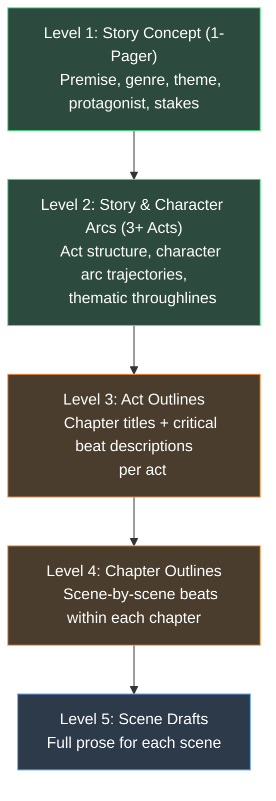
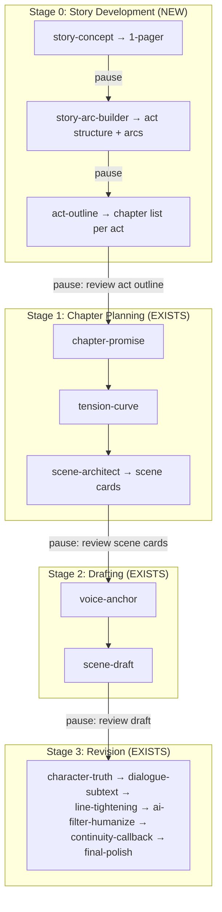

# Hierarchical Story Development: Gap Analysis

## The Workflow You Want



## What the Current System Actually Covers

| Level | What You Need | What Exists | Gap |
|-------|--------------|-------------|-----|
| **1. Concept** | 1-pager: premise, genre, stakes, central question | `story-promise` skill (partial) + `story-bible.template.md` (premise section is a stub) | **Partial.** `story-promise` defines the narrative contract but doesn't produce a full 1-pager. The template has fields but no skill drives filling them. |
| **2. Arcs & Acts** | Character arcs across the story, 3+ act structure, thematic throughlines | `story-bible.template.md` has a "Story Structure" section with Beginning Hook / Middle Build / Ending Payoff — but only headers, no detail. No skill exists. | **Missing entirely.** No skill generates act structure, character arc trajectories, or maps arcs across acts. |
| **3. Act Outlines** | Per-act: chapter titles + critical beat descriptions | Nothing. No template, no skill, no pipeline stage. | **Missing entirely.** |
| **4. Chapter Outlines** | Per-chapter: scene beats, tension curve, scene cards | `chapter-promise` → `tension-curve` → `scene-architect` (3 skills, well-designed) | **Well covered.** This is the system's strongest area. |
| **5. Scene Drafts** | Full prose per scene | `voice-anchor` → `scene-draft` → revision skills (6 skills) | **Well covered.** Full drafting + revision pipeline exists. |

### Visual Coverage Map

```
Level 1  ▓░░░░░░░░░  ~15% covered (story-promise exists but partial)
Level 2  ░░░░░░░░░░   0% covered (no skill, no template)
Level 3  ░░░░░░░░░░   0% covered (no skill, no template)
Level 4  ▓▓▓▓▓▓▓▓▓▓  ~95% covered (chapter-promise → tension-curve → scene-architect)
Level 5  ▓▓▓▓▓▓▓▓▓▓  ~95% covered (voice-anchor → scene-draft → 6 revision skills)
```

> [!IMPORTANT]
> **The system is designed bottom-up, not top-down.** It excels at chapter→scene work but has no mechanism for the editorial-style development process where a concept progressively gains detail through act and chapter planning stages.

---

## What's Specifically Missing

### 1. No "Story Concept" Skill (Level 1)

The `story-promise` skill is close but produces only a promise *statement* (genre, central question, stakes). An editor's 1-pager needs:

- **Premise paragraph** (what happens, to whom, why it matters)
- **Protagonist + Antagonist** (force/counterforce)
- **Genre + tone** (reader expectation contract)
- **Central question** ← `story-promise` does this
- **Stakes** (personal, public, philosophical) ← `story-promise` does this partially
- **World in a sentence** (grounding detail)
- **Controlling idea** ← `story-bible.template.md` has a field but no skill fills it
- **Comparable titles / audience**

### 2. No "Story Arc" Skill (Level 2)

Nothing in the system produces:
- **Act structure** (3-act, 4-act, or 5-act breakdown with act-level turning points)
- **Character arc trajectories** (where each major character starts, what they face, how they change)
- **Thematic throughlines** (how the controlling idea is tested across acts)
- **Subplot mapping** (which subplots live in which acts)

The `story-bible.template.md` has Beginning Hook / Middle Build / Ending Payoff headers but they're blank stubs — no skill generates content for them, and they lack the detail your workflow needs (chapter assignments, act-level beats, character arc positions per act).

### 3. No "Act Outline" Skill (Level 3)

Nothing produces per-act output like:
- **Chapter titles within this act**
- **Critical story beats per chapter** (1-2 sentence descriptions)
- **Which character arcs advance in which chapters**
- **Act-level pacing** (where the act-level turning point falls)
- **Subplot threading** (which chapters carry which subplots)

### 4. The Co-Author Docs *Describe* But Don't Implement These Levels

The [05_AI_COAUTHOR_PLAN.md](file:///c:/Users/david/OneDrive/G-drive/K-D/Claude-Writing-Skills/05_AI_COAUTHOR_PLAN.md) describes:
- **Stage 0: Seed + Intent** → maps to Level 1 (concept)
- **Stage 2: Plot & Philosophy Architecture** → maps to Level 2 (arcs/acts)
- **Stage 3: Scene Blueprinting** → maps to Level 4 (chapter outlines)

But these are documentation only — no skills, templates, or pipeline-run stages implement them.

---

## How to Fix This: New Skills & Templates Needed

### New Skill: `story-concept` (Level 1)

| Field | Value |
|-------|-------|
| **Input** | Genre, protagonist sketch, inciting situation, world premise, comparable titles |
| **Output** | A structured 1-pager: premise paragraph, protagonist/antagonist, genre contract, central question, stakes (3 layers), controlling idea, world grounding |
| **References** | `story-promise` skill output (if available), `story-bible.template.md` |
| **Pipeline position** | Stage 0, Step 1 (before everything) |

### New Skill: `story-arc-builder` (Level 2)

| Field | Value |
|-------|-------|
| **Input** | Story concept (Level 1 output), character profiles, genre conventions |
| **Output** | Act structure with act-level turning points, character arc trajectories (start/midpoint/end per character), thematic pressure points, subplot map |
| **References** | Story Grid global story structure, genre obligatory scenes |
| **Pipeline position** | Stage 0, Step 2 |

### New Skill: `act-outline` (Level 3)

| Field | Value |
|-------|-------|
| **Input** | Story arc (Level 2 output), act number |
| **Output** | Ordered list of chapters with: title, 1-2 sentence beat description, character arc position, subplot threads, pacing notes |
| **References** | Character arc trajectories, subplot map |
| **Pipeline position** | Stage 0, Step 3 (run once per act) |

### New Templates Needed

| Template | Purpose |
|----------|---------|
| `story-concept.template.md` | Structured 1-pager format |
| `story-arc.template.md` | Act structure + character arc trajectory + subplot map |
| `act-outline.template.md` | Per-act chapter list with beats |

### Revised Pipeline



### Information Flow (Top-Down)

```
story-concept output ─────────────┐
                                   ▼
story-arc-builder output ─────────┐
  (act structure, character arcs)  │
                                   ▼
act-outline output ───────────────┐
  (chapter titles + beats)        │
                                   ▼
chapter-promise input ◄────────── feeds chapter number + context
  │
  ▼
tension-curve input ◄──────────── feeds chapter promise
  │
  ▼
scene-architect input ◄────────── feeds tension map
  │
  ▼
scene-draft input ◄────────────── feeds scene cards
```

Each level's output becomes the **required input** for the next level, enforcing the hierarchy.

---

## Summary

| What exists | What's missing | Effort to fix |
|-------------|---------------|---------------|
| Levels 4-5 are excellent (chapter planning + scene drafting + revision) | Levels 1-3 are absent or stub-only | 3 new skills + 3 new templates + pipeline-run update |
| The co-author docs (05-07) *describe* the missing levels conceptually | No implementation of Seed, Plot Architecture, or Act structure | Skills need to be written; templates need to be designed |
| `story-promise` covers ~15% of Level 1 | Needs expansion into full 1-pager skill, or a new `story-concept` skill that calls `story-promise` internally | 1 new or expanded skill |

The system currently works like an editor who **starts at the chapter level** and works down. Your workflow needs an editor who starts at the **concept level** and builds detail progressively. The existing chapter-and-scene skills are strong — the gap is entirely in the upstream planning layers.
