# Unified MOE Mob + Context Management

## Revised Flow: Mode B Folded Into Mode C

Mode B (structuring) is now **Phase 1 of the MOE Mob**, not a separate mode:


### Phase 1: The Structure Offer

The Lead Editor's first action is always:

> **Lead Editor**: "Here's how I've organized your input into [Step Name] format. Want me to adjust anything before we start the review?"

The human can:
- **Accept**: "Looks good, start comments"
- **Adjust**: "Move X under Y, and I forgot to mention Z"
- **Override**: "I'll write it myself, just comment when I'm done"
- **Skip**: "I already structured this, go straight to comments"

Structuring is the opening move of the mob, not a separate workflow.

---

## Context Pollution: The Problem

Without management, context grows uncontrollably:

```
Step 1: Story Concept
  → Human input (500 tokens)
  → Lead Editor structures (800 tokens)
  → 4 agents × ~3 comments × back-and-forth (~6,000 tokens)
  → Second round (~4,000 tokens)
  = ~11,300 tokens of deliberation
  
Step 2: Act 1 Arcs  
  → NOW carries all of Step 1's deliberation
  → Plus Step 2's own work (~10,000 tokens)
  
Step 3: Act 1 Outline
  → 21,300+ tokens of OLD deliberation
  → Most irrelevant to current work
  → Agents start referencing rejected ideas from Step 1
  → "As we discussed earlier..." → DRIFT
```

**Two diseases**:
- **Context pollution**: Old deliberation (rejected ideas, tangential discussion) biases agent responses
- **Context drift**: Agents reference conversation history instead of canonical files, and the two diverge

---

## Solution: Conversation Is Scratch Paper, Files Are Memory

### Core Principle

> **The conversation is scratch paper. The canonical files are memory.**
> 
> When a step completes, the deliberation is discarded. Only the committed artifact persists. When starting a new step, agents load context from files only, never from conversation history.

```mermaid
flowchart LR
    subgraph "Scratch (Ephemeral)"
        CONV["Conversation
        Human input
        Agent comments
        Back-and-forth
        Rejected ideas"]
    end
    
    subgraph "Memory (Persistent)"
        FILES["Canonical Files
        story-concept.md
        story-arc.md
        act-1-outline.md
        ch1-outline.md
        pipeline-state.yaml"]
    end
    
    CONV -->|"Phase 4: Commit"| FILES
    FILES -->|"New step: Load context"| CONV
    CONV -.->|"discarded after commit"| TRASH["🗑️"]
```



---

### At Step Completion (Phase 4: Commit)

The Lead Editor does three things:

1. **Writes the canonical artifact** to file (e.g., `canon/story-concept.md`)
2. **Appends a decision log entry** (brief):
   ```markdown
   ## Step: Story Concept — 2026-02-10
   - Decided: Marcus is ex-SF with prosthetic (Character Specialist)
   - Decided: Zones reject inorganic material (Depth Partner expanded)
   - Rejected: Elena caused the earthquake (too early per human)
   - Open: Zone boundary ambiguity (deferred to Act 1 outline)
   ```
3. **Signals context reset**: Next step starts fresh, loading only relevant files

### At Step Start (Context Loading)

When entering any step, load **only**:

| Category | What's Loaded | Why |
|----------|--------------|-----|
| **Always** | `pipeline-state.yaml`, `preferences.md` | Navigation + writer style |
| **Parent chain** | Only ancestors of current node | Hierarchical context |
| **Current node** | The artifact being worked on (if exists) | Starting point |
| **Siblings** | Previous chapter/scene (optional, on request) | Continuity |
| **Reference** | Relevant `characters/*.md`, `world-rules.md` | Story facts |
| **Never** | Previous conversation turns | Zero pollution guarantee |
| **Never** | Decision logs from other steps (unless explicitly requested) | No cross-step bleed |

### Context Budget (200K window)

| Category | Budget | Notes |
|----------|--------|-------|
| System prompt + agent roles | ~5K | Fixed |
| Pipeline state + preferences | ~2K | Minimal |
| Parent chain artifacts | ~10-30K | Scales with depth |
| Current node artifact | ~5K | What we're building |
| Reference files | ~15K | Characters, world rules |
| **Available for mob conversation** | **~143-163K** | Plenty for deep discussion |

---

## Context Drift Prevention: Five Techniques

### 1. Agents Quote Files, Not Conversation

```
❌ "Earlier you mentioned Marcus has a prosthetic leg..."
✅ "Per characters/marcus.md, his prosthetic prevents Zone 3 
    entry. Does this scene respect that constraint?"
```

Agents cite canonical files, never "as we discussed."

### 2. Immediate File Updates on Resolution

When a comment resolves with a substantive change, the Lead Editor updates the file **during the conversation**:

> **Human**: "Yes, let's make Elena know sign language."
> **Lead Editor**: "Updated `characters/elena.md`. Continuing."

Prevents drift where conversation agrees but files don't reflect it.

### 3. Periodic Canon Check

Every 3-4 comments, Lead Editor silently compares conversation state against files. If drift detected:

> **Lead Editor**: "Consistency note — we've been discussing Marcus as *reluctant* to enter Zone 3, but the concept file says he *can't* due to the prosthetic. Which is canonical?"

### 4. Anchor Artifact at Session Start

Lead Editor posts the **current artifact** at the beginning as a visible reference:

> **Lead Editor**: "Here's the current state of Act 1 Outline. All comments should reference this version."

### 5. Session Boundaries (Strongest Protection)

| Approach | Pollution Risk | Tradeoff |
|----------|---------------|----------|
| Same conversation, manual pruning | Medium | Convenient but leaky |
| Same conversation + explicit reset | Low | Requires discipline |
| **New conversation per step** | **Zero** | Files are sole handoff |

**New conversation per step is recommended** for anything beyond 2-3 steps. Pipeline-state + canonical artifacts provide complete handoff. No deliberation bleeds between steps.

---

## Full Protocol Example: One Step

```
═══════════════════════════════════════════════════
 STEP: Act 1 Outline  |  Position: L3/Act1
 Context loaded: concept.md, story-arc.md,
   characters/*.md, world-rules.md
═══════════════════════════════════════════════════

PHASE 1: STRUCTURE
──────────────────
HUMAN: "Act 1 needs 5 chapters. Marcus arrives at 
the zone perimeter, meets Elena, they argue about 
approach, first attempt fails, Marcus discovers 
the zones are changing..."

LEAD EDITOR: "Structured:
 Ch1: Perimeter — Marcus reaches Zone boundary.
      Beat: refusal to ask for help.
 Ch2: The Navigator — Elena appears, offers help 
      for a price. Beat: reluctant alliance.
 Ch3: The Approach — Disagreement on method. 
      Beat: Elena reveals zone knowledge.
 Ch4: First Attempt — Entry fails, prosthetic 
      triggers rejection. Beat: Marcus faces limitation.
 Ch5: Shifting Ground — Zones are evolving. 
      Beat: rules they planned for no longer apply.

Adjust before comments?"
