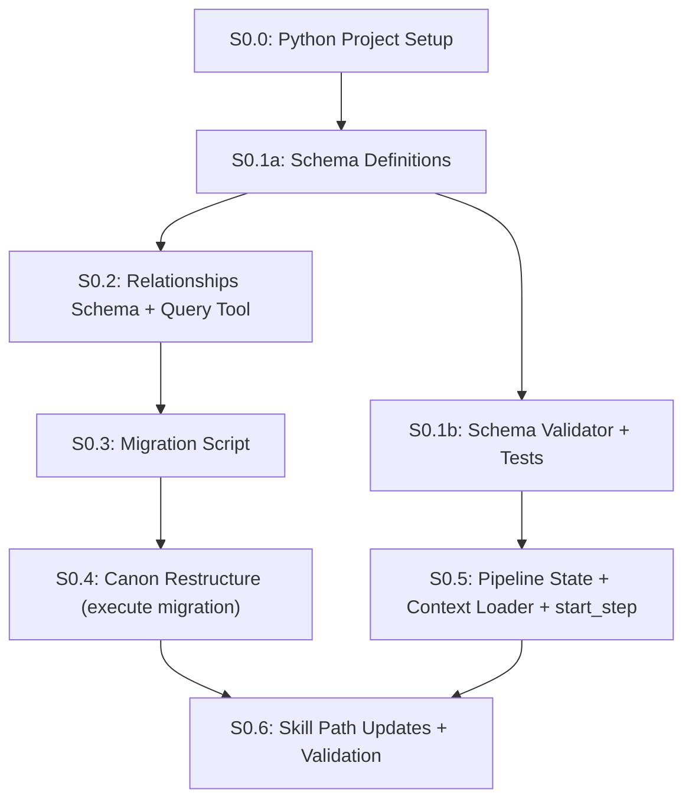

# Phase 0: Foundation — Detailed Plan

## Build Order & Dependencies



**Critical path**: S0.0 → S0.1a → S0.2 → S0.3 → S0.4 → S0.6

**Parallel track**: S0.1a → S0.1b → S0.5 (can proceed once schema definitions exist, independent of S0.2–S0.4)

---

## S0.0: Python Project Setup

**Goal**: Establish the Python project structure and pinned dependencies so all subsequent steps can import shared libraries without ad-hoc installs.

### Files to Create

| File | Purpose |
|------|---------|
| [NEW] `pyproject.toml` | Project metadata, Python >=3.11 requirement, pinned dependencies |
| [NEW] `tests/conftest.py` | Shared pytest fixtures (project root path, tmp canon trees) |

### Dependencies

```toml
[project]
name = "fiction-pipeline"
requires-python = ">=3.11"
dependencies = [
    "jsonschema>=4.20",
    "pyyaml>=6.0",
    "pytest>=8.0",
]
```

### Decisions

- **Schema format**: JSON Schema 2020-12 (`$schema: "https://json-schema.org/draft/2020-12/schema"`).
- **Validation library**: `jsonschema` (Python). All schemas validated through a single `schema_validator.py` wrapper.
- **Each schema file** must include `$id` (e.g., `agent_comment/v1`) and `$schema` fields. Bump the version segment in `$id` on any breaking change.

### Pass Criteria
- `pip install -e .` (or `uv pip install -e .`) succeeds
- `pytest --collect-only` discovers the test directory
- `python -c "import jsonschema; import yaml"` exits 0
- `git tag phase0/s0.0`

---

## S0.1a: Schema Definitions

**Goal**: Define all data contract schemas. These are the YAML/JSON files only — no validator code yet.

### Files to Create

| File | Purpose |
|------|---------|
| [NEW] `schemas/node_input.schema.yaml` | What goes into a skill/agent call |
| [NEW] `schemas/agent_comment.schema.yaml` | What an agent returns |
| [NEW] `schemas/continuity_report.schema.yaml` | What the continuity agent returns |
| [NEW] `schemas/commit_patch.schema.yaml` | What gets committed to canon |
| [NEW] `schemas/trace_record.schema.yaml` | Complete session record |
| [NEW] `schemas/relationships.schema.yaml` | Entity + relationship validation |
| [NEW] `schemas/pipeline_state.schema.yaml` | Pipeline state file validation |

### Schema Standards

Every schema file must include:
```yaml
$schema: "https://json-schema.org/draft/2020-12/schema"
$id: "<schema_name>/v1"
```

### Pass Criteria
- Every `.schema.yaml` file is valid JSON Schema 2020-12 (parseable by `jsonschema`)
- Each schema has `$id` and `$schema` fields
- `git tag phase0/s0.1a`

---

## S0.1b: Schema Validator + Tests

**Goal**: Build the shared validation utility and TDD tests for all schemas defined in S0.1a.

### Files to Create

| File | Purpose |
|------|---------|
| [NEW] `scripts/schema_validator.py` | Shared validation utility |
| [NEW] `tests/test_schemas.py` | TDD: tests written first |

### TDD Approach

**Write tests first**, then validator:

```python
# tests/test_schemas.py

def test_valid_agent_comment_passes():
    """A correctly formed agent comment should pass validation."""
    comment = {
        "agent": "plot_analyst",
        "model": "claude-haiku",
        "comment": "Ch3 feels like a stall — no value shift.",
        "citations": ["canon/acts/act-1/ch3-outline.md#L12"],
        "suggested_changes": [],
        "resolution": None  # not yet resolved
    }
    assert validate("agent_comment", comment).ok

def test_agent_comment_missing_citations_fails():
    """Comments without citations list should fail."""
    comment = {"agent": "plot_analyst", "comment": "Something vague"}
    result = validate("agent_comment", comment)
    assert not result.ok
    assert "citations" in result.errors[0]

def test_relationship_entry_bad_vocabulary_fails():
    """Rel terms not in controlled vocabulary should fail."""
    rel = {"from": "marcus", "to": "elena", "rel": "is_suspicious_of", ...}
    result = validate("relationships", {"relationships": [rel]})
    assert not result.ok
    assert "vocabulary" in result.errors[0]

def test_valid_commit_patch_requires_citation():
    """Canon mutations must have citation chains (M5)."""
    patch = {
        "canon_changes": [{"file": "canon/acts/act-1-outline.md", "action": "update"}],
        "relationship_changes": [{"id": "rel_001", "field": "valid_to", "new_value": "Act2/Ch1"}],
        "citations": []  # empty!
    }
    result = validate("commit_patch", patch)
    assert not result.ok
    assert "citation" in result.errors[0]
```

### Pass Criteria
- `pytest tests/test_schemas.py` — all tests pass
- Every schema can validate a correct example and reject a malformed one
- `python scripts/schema_validator.py schemas/agent_comment.schema.yaml examples/valid_comment.yaml` exits 0
- `python scripts/schema_validator.py schemas/agent_comment.schema.yaml examples/bad_comment.yaml` exits 1 with actionable error
- `git tag phase0/s0.1b`

---

## S0.2: Relationships Schema + Query Tool

**Goal**: Build the entity-relationship YAML format and the query/mutation tool. TDD is high-value here because this is the core data structure.

**Depends on**: S0.1a (uses `schemas/relationships.schema.yaml` as the contract to build against).

### Temporal Position Format

Relationship positions use the format `Act{N}/Ch{M}` (e.g., `Act1/Ch3`, `Act2/Ch12`). String comparison is **not safe** for ordering (e.g., `"Ch10" < "Ch9"` lexicographically). All temporal comparisons must use a canonical parser:

```python
def parse_position(pos: str) -> tuple[int, int]:
    """Parse 'Act{N}/Ch{M}' into (act, chapter) tuple for safe comparison."""
    match = re.match(r"Act(\d+)/Ch(\d+)", pos)
    if not match:
        raise ValueError(f"Invalid position format: {pos}")
    return (int(match.group(1)), int(match.group(2)))
```

This parser must be used in `relationship_query.py` for all `as_of` filtering and temporal overlap detection.

### Vocabulary Extensibility

The controlled vocabulary (`rel_vocabulary`) is stored **inside `relationships.yaml`**, not in the schema. This makes it project-configurable — each story can extend the vocabulary by adding terms to the YAML file. The schema enforces that the `rel` field of every relationship entry matches a term in the file's own `rel_vocabulary` section. Adding a new rel term requires only editing `relationships.yaml`, not changing a schema.

### Files to Create

| File | Purpose |
|------|---------|
| [NEW] `canon/relationships.yaml` | Empty scaffold with vocabulary + example entity |
| [MODIFY] `schemas/relationships.schema.yaml` | Already defined in S0.1a, refined here with vocabulary constraints |
| [NEW] `scripts/relationship_query.py` | CLI tool: query, add, validate, render_matrix |
| [NEW] `tests/test_relationships.py` | TDD: tests first |
| [NEW] `tests/fixtures/sample_relationships.yaml` | Test fixture (LOTR example from current matrix) |

### TDD Approach

```python
# tests/test_relationships.py

# --- Core query/mutation ---

def test_query_by_entity_returns_all_aliases():
    """Querying 'marcus' should also return results for 'the soldier'."""
    rels = load_fixture("sample_relationships.yaml")
    results = query(rels, entity="marcus")
    assert any(r["from"] == "marcus" for r in results)
    # Also found via alias search in text

def test_add_rejects_unknown_rel_vocabulary():
    """Cannot add a relationship with rel='is_suspicious_of' (not in vocab)."""
    with pytest.raises(VocabularyError):
        add(rels, from_e="marcus", to_e="elena", rel="is_suspicious_of", ...)

def test_add_valid_relationship():
    """Adding a valid relationship appends and preserves existing."""
    before_count = len(rels["relationships"])
    add(rels, from_e="marcus", to_e="zone_3", rel="fears",
        context="first encounter", valid_from="Act1/Ch2",
        confidence="medium", source="canon/acts/act-1/ch2-outline.md#L5")
    assert len(rels["relationships"]) == before_count + 1

def test_render_matrix_produces_markdown():
    """render_matrix should output a valid markdown table."""
    md = render_matrix(rels, as_of="Act1/Ch5")
    assert "| From" in md
    assert "marcus" in md.lower()

def test_validate_strict_gate():
    """--validate should catch all schema violations."""
    result = subprocess.run(
        ["python", "scripts/relationship_query.py", "--validate",
         "--file", "tests/fixtures/bad_relationships.yaml"],
        capture_output=True)
    assert result.returncode != 0

# --- Temporal ordering ---

def test_query_as_of_filters_temporally():
    """Querying as_of='Act1/Ch3' should not return relationships from Act2."""
    results = query(rels, entity="marcus", as_of="Act1/Ch3")
    for r in results:
        assert parse_position(r["valid_from"]) <= parse_position("Act1/Ch3")

def test_query_as_of_handles_double_digit_chapters():
    """Act1/Ch10 must sort after Act1/Ch9, not before."""
    results = query(rels, entity="marcus", as_of="Act1/Ch10")
    for r in results:
        assert parse_position(r["valid_from"]) <= (1, 10)

# --- Semantic integrity edge cases ---

def test_validate_catches_broken_supersession():
    """If rel_002 says supersedes: rel_001, but rel_001 has no superseded_by."""
    result = validate_relationships(broken_fixture)
    assert not result.ok
    assert "supersession" in result.errors[0]

def test_validate_catches_circular_supersession():
    """rel_001 supersedes rel_002 supersedes rel_001 should fail."""
    result = validate_relationships(circular_supersession_fixture)
    assert not result.ok
    assert "circular" in result.errors[0]

def test_validate_catches_duplicate_entity_ids():
    """Two entities with the same ID should fail validation."""
    result = validate_relationships(duplicate_entity_fixture)
    assert not result.ok
    assert "duplicate" in result.errors[0]

def test_validate_catches_duplicate_relationship_ids():
    """Two relationships with the same ID should fail validation."""
    result = validate_relationships(duplicate_rel_fixture)
    assert not result.ok
    assert "duplicate" in result.errors[0]

def test_validate_catches_alias_collision():
    """Two different entities claiming the same alias should fail."""
    result = validate_relationships(alias_collision_fixture)
    assert not result.ok
    assert "alias" in result.errors[0]

def test_validate_catches_temporal_overlap():
    """Two active rels of the same type between same entities should warn."""
    result = validate_relationships(temporal_overlap_fixture)
    assert not result.ok
    assert "overlap" in result.errors[0]

def test_validate_checks_source_citation_format():
    """Source field must match 'canon/path/file.md#L{N}' format."""
    result = validate_relationships(bad_source_fixture)
    assert not result.ok
    assert "source" in result.errors[0]
```

### Pass Criteria
- `pytest tests/test_relationships.py` — all tests pass
- `python scripts/relationship_query.py --validate --file canon/relationships.yaml` exits 0
- `python scripts/relationship_query.py query --entity marcus --file canon/relationships.yaml` returns results
- `python scripts/relationship_query.py render-matrix --file canon/relationships.yaml` outputs readable markdown
- `--validate` rejects: circular supersession, duplicate IDs, alias collisions, bad source format, temporal overlaps
- `git tag phase0/s0.2`

---

## S0.3: Migration Script

**Goal**: Safe, reversible migration of `bible/` → `canon/world/` with ref updates.

### Current State (What Exists)

| Source | Destination | Action |
|--------|------------|--------|
| `bible/story-bible.md` (1475 bytes) | `canon/world/story-bible.md` | Move |
| `bible/world-rules.md` (334 bytes) | `canon/world/world-rules.md` | Move |
| `bible/scene-tracker.md` (674 bytes) | `canon/timeline.md` | Merge with existing stub (90 bytes) |
| `canon/Entity-relationship-matrix.md` | Delete (replaced by `relationships.yaml`) | Archive content in test fixture |
| `canon/world/README.md` | Delete after migration | Replaced by `story-bible.md` as directory content |
| `CLAUDE.md` lines 14, 26-28 | Update `bible/` → `canon/` refs | In-place update |
| Skills referencing "bible" | Update to "canon" | 3 skills: `continuity-callback`, `scene-draft`, `character-truth` |

> **README.md cleanup**: Placeholder `README.md` files in `canon/world/`, `canon/characters/`, `canon/tech/`, and `canon/themes/` exist only as directory markers. After migration populates a directory with real content, the corresponding `README.md` is deleted. Directories that remain empty keep their `README.md`.

### Repo-Wide Verification Scope

The `--verify` flag must scan the **entire repo tree** for residual `bible/` references, not just the skills listed above. Scan targets:

- `.claude/skills/**/*.md`
- `.claude/commands/**/*.md`
- `CLAUDE.md`
- `docs/**/*.md`
- `scripts/**/*.py`
- `templates/**/*.md`
- `canon/**/*.md`

Any non-comment `bible/` reference found by `--verify` is a failure. The report must include counts by file class.

### Files to Create

| File | Purpose |
|------|---------|
| [NEW] `scripts/migrate_bible_to_canon.py` | Migration with --dry-run, --execute, --rollback, --verify |
| [NEW] `tests/test_migration.py` | TDD: tests on temp directory copies |

### TDD Approach

```python
# tests/test_migration.py

def test_dry_run_produces_mapping_report(tmp_path):
    """--dry-run should list all planned moves without touching files."""
    create_test_repo(tmp_path)
    report = run_migration(tmp_path, dry_run=True)
    assert "bible/story-bible.md → canon/world/story-bible.md" in report
    assert (tmp_path / "bible" / "story-bible.md").exists()  # NOT moved

def test_execute_moves_files(tmp_path):
    """--execute should move files and update refs."""
    create_test_repo(tmp_path)
    run_migration(tmp_path, execute=True)
    assert (tmp_path / "canon" / "world" / "story-bible.md").exists()
    assert not (tmp_path / "bible" / "story-bible.md").exists()

def test_rollback_reverts(tmp_path):
    """--rollback should restore bible/ from rollback file."""
    create_test_repo(tmp_path)
    run_migration(tmp_path, execute=True)
    run_migration(tmp_path, rollback=True)
    assert (tmp_path / "bible" / "story-bible.md").exists()

def test_verify_catches_broken_refs(tmp_path):
    """--verify should fail if skills still reference bible/."""
    create_test_repo(tmp_path)
    run_migration(tmp_path, execute=True)
    # Manually break a ref
    skill = tmp_path / ".claude" / "skills" / "continuity-callback" / "SKILL.md"
    skill.write_text(skill.read_text().replace("canon", "bible"))
    result = run_migration(tmp_path, verify=True)
    assert not result.ok

def test_verify_scans_entire_repo(tmp_path):
    """--verify should catch bible/ refs in docs, scripts, and templates too."""
    create_test_repo(tmp_path)
    run_migration(tmp_path, execute=True)
    # Plant a stale ref in docs/
    stale_doc = tmp_path / "docs" / "some_doc.md"
    stale_doc.write_text("See bible/story-bible.md for details.")
    result = run_migration(tmp_path, verify=True)
    assert not result.ok
    assert "docs/some_doc.md" in result.report

def test_verify_produces_report_with_counts(tmp_path):
    """--verify should produce a report listing remaining refs by file class."""
    create_test_repo(tmp_path)
    run_migration(tmp_path, execute=True)
    result = run_migration(tmp_path, verify=True)
    assert "files_scanned" in result.report
    assert "remaining_refs" in result.report

def test_scene_tracker_merge(tmp_path):
    """scene-tracker.md content should be appended to timeline.md."""
    create_test_repo(tmp_path)
    run_migration(tmp_path, execute=True)
    timeline = (tmp_path / "canon" / "timeline.md").read_text()
    assert "Track immutable event ordering" in timeline  # existing stub
    assert len(timeline) > 100  # merged content is present

def test_partial_failure_leaves_clean_state(tmp_path):
    """If ref update fails mid-way, files should not be left half-migrated."""
    create_test_repo(tmp_path)
    # Make a ref-update target read-only to force failure
    skill = tmp_path / ".claude" / "skills" / "continuity-callback" / "SKILL.md"
    skill.chmod(0o444)
    with pytest.raises(MigrationError):
        run_migration(tmp_path, execute=True)
    # Original files should still exist (rolled back on failure)
    assert (tmp_path / "bible" / "story-bible.md").exists()
```

### Pass Criteria
- `python scripts/migrate_bible_to_canon.py --dry-run` shows correct mapping without changes
- `python scripts/migrate_bible_to_canon.py --execute` moves all files, updates refs
- `python scripts/migrate_bible_to_canon.py --verify` passes (scans full repo tree)
- `python scripts/migrate_bible_to_canon.py --rollback` restores original state
- `pytest tests/test_migration.py` — all pass
- `git tag phase0/s0.3`

---

## S0.4: Canon Restructure (Execute Migration)

**Goal**: Run the migration on the real repo and create the hierarchical directory structure.

### Actions (Automated by Migration Script + Manual Setup)

1. Run `python scripts/migrate_bible_to_canon.py --execute`
2. Create new directories:
   - `canon/acts/` (empty, ready for act outlines)
3. Update `canon/index.md` to reference new structure
4. Archive `Entity-relationship-matrix.md` content into test fixture
5. Verify: `python scripts/migrate_bible_to_canon.py --verify`
6. `git tag phase0/s0.4 && git commit -m "phase0: migrate bible/ to canon/, restructure for hierarchy"`

### Pass Criteria

Verification uses the migration script's `--verify` flag (which scans the full repo) plus manual spot-checks. The updated `validate_coauthor_setup.py` is not available until S0.6 — do **not** depend on it here.

- `python scripts/migrate_bible_to_canon.py --verify` exits 0 (full-repo scan, zero `bible/` refs)
- `canon/world/story-bible.md` exists with original content
- `canon/world/world-rules.md` exists with original content
- `canon/timeline.md` contains merged scene-tracker content
- `canon/acts/` directory exists
- `canon/relationships.yaml` exists and passes schema validation
- `bible/` is removed (no backward-compat redirects — clean break)
- `git log -1` shows the migration commit

---

## S0.5: Pipeline State + Context Loader + start_step

**Goal**: Build the session management layer.

### Files to Create

| File | Purpose |
|------|---------|
| [NEW] `.pipeline-state.yaml` | Initial pipeline state (empty project, position at L1) |
| [NEW] `scripts/context_loader.py` | Reads state, outputs file list for context loading |
| [NEW] `scripts/start_step.bat` | Windows wrapper for zero-friction session start |
| [NEW] `scripts/start_step.sh` | Unix wrapper (parity with .bat for portability) |
| [NEW] `tests/test_context_loader.py` | TDD: context loading rules |

### Test Fixture Definition

Tests use a `FIXTURE_ROOT` directory containing a fully-populated mock canon tree. The `conftest.py` fixture (from S0.0) builds this structure in `tmp_path`:

```
FIXTURE_ROOT/
├── CLAUDE.md
├── canon/
│   ├── index.md
│   ├── story-concept.md          # synthetic L1 output (stub content)
│   ├── story-arc.md              # synthetic L2 output (stub content)
│   ├── timeline.md
│   ├── relationships.yaml
│   ├── preferences.md
│   ├── characters/
│   │   └── marcus.md
│   ├── world/
│   │   ├── story-bible.md
│   │   └── world-rules.md
│   ├── acts/
│   │   ├── act-1-outline.md      # synthetic L3 output
│   │   ├── act-1/
│   │   │   ├── ch1-outline.md    # synthetic L4 output
│   │   │   ├── ch1/
│   │   │   │   └── sc1-draft.md  # synthetic L5 output
│   │   │   └── ch2-outline.md
│   │   └── act-2-outline.md
│   └── style-samples/
│       └── sample-01.md
└── .pipeline-state.yaml
```

These are stub files (minimal content, correct paths). The fixture ensures tests don't depend on real story content that only exists after Phase 1.

### Context Budget (Placeholder)

The manifest output must include a `total_estimated_tokens` field (approximate, based on file sizes). `.pipeline-state.yaml` must include a `max_context_tokens` field (default: 100000). Full ranking, truncation, and fallback logic is deferred to Phase 1 when real content exists to calibrate against.

### TDD Approach

```python
# tests/test_context_loader.py

def test_l1_concept_loads_system_files_only():
    """At L1 (story concept), only system files should be loaded."""
    state = make_state(level="L1", position="concept")
    files = context_loader.get_manifest(state, root=FIXTURE_ROOT)
    assert "CLAUDE.md" in files
    assert "canon/index.md" in files
    assert not any("acts/" in f for f in files)

def test_l3_act2_loads_parent_chain_plus_sibling():
    """At L3/Act2, should load: concept, arc, act-1-outline (sibling), act-2-outline."""
    state = make_state(level="L3", act=2)
    files = context_loader.get_manifest(state, root=FIXTURE_ROOT)
    assert "canon/story-concept.md" in files
    assert "canon/story-arc.md" in files
    assert "canon/acts/act-1-outline.md" in files  # sibling
    assert "canon/acts/act-2-outline.md" in files  # current

def test_l5_scene_loads_chapter_outline_and_character_files():
    """At L5 (scene draft), should load chapter outline + referenced characters."""
    state = make_state(level="L5", act=1, chapter=2, scene=1)
    files = context_loader.get_manifest(state, root=FIXTURE_ROOT)
    assert "canon/acts/act-1/ch2-outline.md" in files
    # Should NOT load act-1/ch1/ scenes (too much context)

def test_manifest_hash_is_deterministic():
    """Same state should produce same manifest hash."""
    state = make_state(level="L3", act=1)
    hash1 = context_loader.get_manifest_hash(state, root=FIXTURE_ROOT)
    hash2 = context_loader.get_manifest_hash(state, root=FIXTURE_ROOT)
    assert hash1 == hash2

def test_reproducibility_bundle_includes_all_fields():
    """Reproducibility bundle should have manifest_hash, canon_version, agent_config."""
    state = make_state(level="L3", act=1)
    bundle = context_loader.get_reproducibility_bundle(state, root=FIXTURE_ROOT)
    assert "context_manifest_hash" in bundle
    assert "canon_version" in bundle
    assert "agent_config" in bundle

def test_manifest_includes_token_estimate():
    """Manifest output should include total_estimated_tokens field."""
    state = make_state(level="L3", act=1)
    manifest = context_loader.get_manifest_with_meta(state, root=FIXTURE_ROOT)
    assert "total_estimated_tokens" in manifest
    assert isinstance(manifest["total_estimated_tokens"], int)

def test_manifest_handles_missing_files_gracefully():
    """If a canonical file doesn't exist yet, it should be omitted, not crash."""
    state = make_state(level="L3", act=3)  # act-3 doesn't exist in fixture
    files = context_loader.get_manifest(state, root=FIXTURE_ROOT)
    assert "canon/acts/act-3-outline.md" not in files
    # Should still include parent chain that does exist
    assert "canon/story-concept.md" in files
```

### Pass Criteria
- `pytest tests/test_context_loader.py` — all pass
- `python scripts/context_loader.py --state .pipeline-state.yaml` outputs a file list with `total_estimated_tokens`
- `scripts/start_step.bat` runs in Antigravity terminal without errors (manual test)
- `git tag phase0/s0.5`

---

## S0.6: Skill Path Updates + Validation

**Goal**: Update all skills, CLAUDE.md, and the setup validator to work with the new `canon/` structure.

### Files to Modify

| File | Change |
|------|--------|
| `.claude/skills/continuity-callback/SKILL.md` | `book_bible_or_notes` → `canon/` refs, `scene_tracker` → `canon/timeline.md` |
| `.claude/skills/scene-draft/SKILL.md` | `World Rules` → `canon/world/world-rules.md` |
| `.claude/skills/character-truth/SKILL.md` | `character_bible` → `canon/` ref |
| `.claude/skills/scene-architect/SKILL.md` | `character_bible` → `canon/` ref |
| `CLAUDE.md` | Update Key Directories, Foundation Setup |
| `canon/index.md` | Update to include new structure (acts/, relationships.yaml, world/) |
| `scripts/validate_coauthor_setup.py` | Add checks for relationships.yaml, acts/, .pipeline-state.yaml, schemas/ |

### Files to Create

| File | Purpose |
|------|---------|
| [NEW] `tests/test_no_bible_refs.py` | Automated regression test for stale `bible/` references |

### Automated Regression Test

Although these are text replacements, a regression test prevents silent breakage:

```python
# tests/test_no_bible_refs.py

def test_no_bible_references_in_skills():
    """No skill file should contain 'bible/' references after migration."""
    skills_dir = Path(".claude/skills")
    for skill_file in skills_dir.rglob("*.md"):
        content = skill_file.read_text()
        assert "bible/" not in content.lower(), f"Stale bible/ ref in {skill_file}"

def test_no_bible_references_in_root_docs():
    """CLAUDE.md and docs/ should not reference bible/."""
    for path in [Path("CLAUDE.md")] + list(Path("docs").rglob("*.md")):
        content = path.read_text()
        # Allow references in migration/plan docs that describe the migration itself
        if "migration" in path.name or "phase0" in path.name or "implementation" in path.name:
            continue
        assert "bible/" not in content.lower(), f"Stale bible/ ref in {path}"
```

Additional verification commands:

```bash
# Full-repo scan (belt and suspenders)
grep -ri "bible/" .claude/skills/ CLAUDE.md templates/ scripts/ canon/  # should return 0 results

# Validation script should pass
python scripts/validate_coauthor_setup.py

# All schemas should validate
python scripts/schema_validator.py --all
```

### Expanded `validate_coauthor_setup.py` Checks

The updated validator must check all of the following:

- Path existence: `canon/index.md`, `canon/timeline.md`, `canon/relationships.yaml`, `canon/acts/`, `canon/world/story-bible.md`, `canon/world/world-rules.md`
- Schema validation: `.pipeline-state.yaml` validates against `schemas/pipeline_state.schema.yaml`
- Schema validation: `canon/relationships.yaml` validates against `schemas/relationships.schema.yaml`
- Required keys in `canon/index.md`: modules list includes `relationships.yaml`, `acts/`, `world/`
- Style sample minimum (existing check, retained)

### Pass Criteria
- `pytest tests/test_no_bible_refs.py` — passes
- `grep -ri "bible/" .claude/skills/ CLAUDE.md templates/ scripts/ canon/` returns nothing
- `python scripts/validate_coauthor_setup.py` passes with expanded checks
- `python scripts/schema_validator.py --all` passes
- `git diff --stat` shows all modified files
- `git tag phase0/s0.6 && git commit -m "phase0: complete — schemas, relationships, migration, pipeline state, skill updates"`

---

## Summary: Build Order

| Step | Section | Key Output | TDD? | Est. Effort |
|------|---------|------------|------|------------|
| 0 | S0.0 | `pyproject.toml`, dependency lock | Setup | Low |
| 1a | S0.1a | `schemas/*.schema.yaml` (definitions only) | N/A | Low-Medium |
| 1b | S0.1b | `scripts/schema_validator.py`, `tests/test_schemas.py` | Tests first | Medium |
| 2 | S0.2 | `canon/relationships.yaml`, `scripts/relationship_query.py` | Tests first | Medium-High |
| 3 | S0.3 | `scripts/migrate_bible_to_canon.py` | Tests first | Medium |
| 4 | S0.4 | Migration executed, `canon/` restructured | Verification | Low |
| 5 | S0.5 | `.pipeline-state.yaml`, `scripts/context_loader.py`, `start_step.*` | Tests first | Medium |
| 6 | S0.6 | Skills + CLAUDE.md updated, validation passing | Tests + verification | Low-Medium |

> [!NOTE]
> Each section ends with a `git tag phase0/s0.{N}` and a commit. To roll back to any step boundary: `git checkout phase0/s0.{N} -- .` restores the full working tree to that step's state.

---

## Phase 0 Exit Checklist

All of the following must pass before Phase 1 work begins:

```bash
# Environment
pip install -e . && python -c "import jsonschema; import yaml"

# Schemas
python scripts/schema_validator.py --all

# Relationships
python scripts/relationship_query.py --validate --file canon/relationships.yaml
pytest tests/test_relationships.py

# Migration integrity
python scripts/migrate_bible_to_canon.py --verify
pytest tests/test_migration.py

# Context loader
pytest tests/test_context_loader.py
python scripts/context_loader.py --state .pipeline-state.yaml

# Skill/ref integrity
pytest tests/test_no_bible_refs.py
python scripts/validate_coauthor_setup.py

# All tests green
pytest
```

Every command above must exit 0. Any failure blocks Phase 1 entry.
