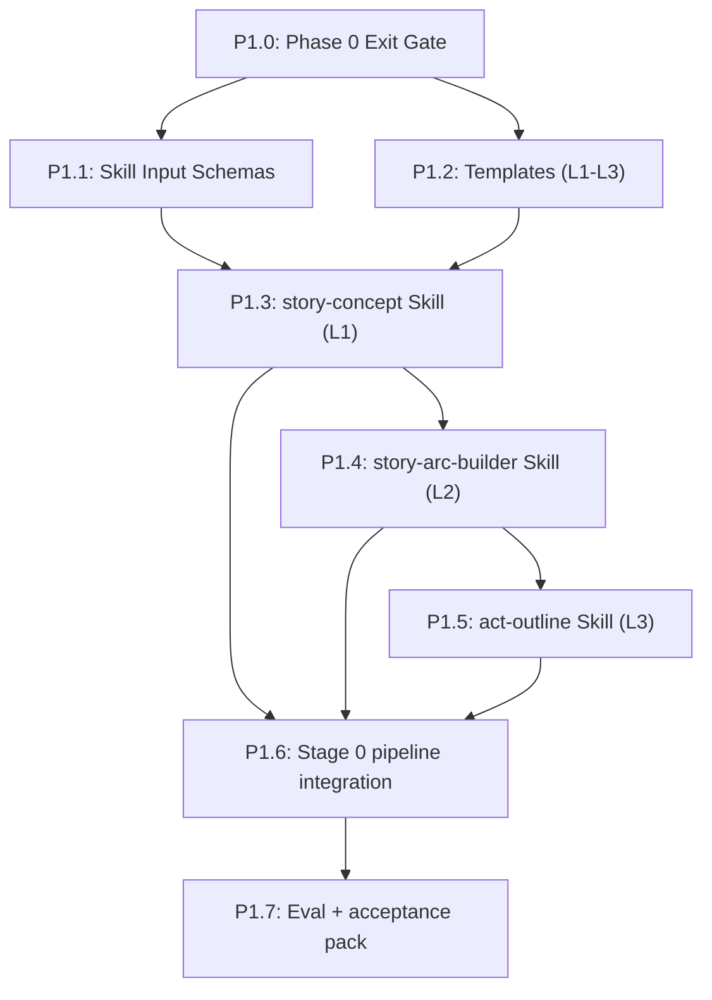

# Phase 1: New Skills (Levels 1–3) — Detailed Plan

## Build Order & Dependencies

**Critical path**: P1.0 → P1.1 → P1.2 → P1.3 → P1.4 → P1.5 → P1.6 → P1.7

---

## P1.0: Phase 0 Exit Gate (Hard Prerequisite)

**Goal**: Block Phase 1 until foundation contracts and canonical layout are stable.

### Required green checks
- `python scripts/validate_coauthor_setup.py --root .`
- `python scripts/schema_validator.py --all` *(if available from Phase 0)*
- `python scripts/relationship_query.py --validate --file canon/relationships.yaml` *(if available)*
- `grep -ri "bible/" .claude/skills .claude/commands CLAUDE.md` returns only compatibility shims

### Pass criteria
- All checks pass in local + CI.
- `.pipeline-state.yaml` exists and validates.

---

## P1.1: Skill Input Schemas

**Goal**: Define strict input contracts for the three new skills.

### Files to modify/create
| File | Purpose |
|------|---------|
| [MODIFY] `schemas/node_input.schema.yaml` | Add `story-concept`, `story-arc-builder`, `act-outline` input definitions |
| [MODIFY] `tests/test_schemas.py` | Add tests for new skill-specific required fields |

### Required fields (minimum)
- **story-concept**: `genre`, `protagonist`, `inciting_situation`
- **story-arc-builder**: `concept_file`, `target_scope` *(default: full story)*
- **act-outline**: `arc_file`, `act_number`

### TDD checks
- `story-concept` missing `genre` fails
- `story-arc-builder` missing `concept_file` fails
- `act-outline` missing `act_number` fails

### Pass criteria
- `pytest tests/test_schemas.py` passes.
- CLI validator accepts valid examples and rejects malformed inputs.

---

## P1.2: Templates (L1–L3)

**Goal**: Lock output structure before skill implementation.

### Files to create
| File | Purpose |
|------|---------|
| [NEW] `templates/story-concept.template.md` | L1 one-pager structure |
| [NEW] `templates/story-arc.template.md` | L2 arc structure |
| [NEW] `templates/act-outline.template.md` | L3 act chapter structure |
| [NEW] `tests/test_templates.py` | Verify required sections and headers |
| [NEW] `examples/phase1/l1_story-concept.example.md` | Golden sample |
| [NEW] `examples/phase1/l2_story-arc.example.md` | Golden sample |
| [NEW] `examples/phase1/l3_act-outline.example.md` | Golden sample |

### Required structure
- L1 includes: core concept, controlling idea, central dramatic question, stakes.
- L2 includes: act progression (4-part target: Act 1, Act 2A, Act 2B, Act 3), arc table, subplot map.
- L3 includes: chapter list, beat intent, value shift/polarity, continuity touchpoints.
- All templates include `Sources`/`Evidence` sections for file-cited reasoning.

### Pass criteria
- `pytest tests/test_templates.py` passes.
- Golden examples match required headings.

---

## P1.3: `story-concept` Skill (L1)

**Goal**: Generate normalized concept artifact at `canon/story-concept.md`.

### Files to create
| File | Purpose |
|------|---------|
| [NEW] `.claude/skills/story-concept/SKILL.md` | Skill definition |
| [NEW] `tests/test_skill_concept.py` | Skill-level integration checks |

### Skill logic
1. Validate input against `node_input` schema.
2. Load `templates/story-concept.template.md`.
3. Load canon references (`canon/world/story-bible.md` if present).
4. Generate filled concept artifact.
5. Write atomically to `canon/story-concept.md`.
6. Update `canon/relationships.yaml` with protagonist entity/aliases when available.

### Pass criteria
- Skill discoverable/invocable.
- Valid input produces template-conformant output.
- Missing required input prompts for completion rather than writing malformed output.

---

## P1.4: `story-arc-builder` Skill (L2)

**Goal**: Convert concept into arc architecture at `canon/story-arc.md`.

### Files to create
| File | Purpose |
|------|---------|
| [NEW] `.claude/skills/story-arc-builder/SKILL.md` | Skill definition |
| [NEW] `tests/test_story_arc_builder.md` | Arc output verification checks |

### Skill logic
1. Load `canon/story-concept.md`.
2. Load `canon/relationships.yaml` (entity roster + aliases).
3. Load `templates/story-arc.template.md`.
4. Generate arc (act progression, trajectories, subplot dependencies).
5. Write to `canon/story-arc.md`.
6. Add relationship deltas implied by arc (with citations).

### Pass criteria
- Output references concept constraints explicitly.
- Character trajectories are traceable across acts.
- Open decisions are surfaced in explicit `OPEN QUESTIONS` block.

---

## P1.5: `act-outline` Skill (L3)

**Goal**: Produce per-act chapter-level outlines at `canon/acts/act-{N}-outline.md`.

### Files to create
| File | Purpose |
|------|---------|
| [NEW] `.claude/skills/act-outline/SKILL.md` | Skill definition |
| [NEW] `tests/test_act_outline_skill.md` | Outline structural + continuity checks |

### Skill logic
1. Validate `act_number` input.
2. Load `canon/story-arc.md`.
3. Load `templates/act-outline.template.md`.
4. Expand selected act into chapter outlines.
5. Write to `canon/acts/act-{N}-outline.md`.
6. Emit continuity touchpoints/entities for sidecar checks.

### Pass criteria
- Ordered chapter list with beat intent and value-shift markers.
- At least one causal dependency per chapter.
- No hidden placeholders (only explicit TODO/QUESTION sections allowed).

---

## P1.6: Integrate Stage 0 into `pipeline-run`

**Goal**: Wire L1→L2→L3 into the documented pipeline with required human pauses.

### Files to modify
| File | Change |
|------|--------|
| [MODIFY] `.claude/commands/pipeline-run.md` | Add Stage 0A/0B/0C and review pauses |
| [MODIFY] `CLAUDE.md` | Add skill references + paths |
| [MODIFY] `README.md` | Update getting-started path with Stage 0 |

### Required flow
1. `story-concept` → `canon/story-concept.md`
2. `story-arc-builder` → `canon/story-arc.md`
3. `act-outline` (per act) → `canon/acts/act-N-outline.md`
4. Pause + approve before Stage 1

### Pass criteria
- Stage 0 docs match actual command flow.
- No active `bible/` references remain.

---

## P1.7: Eval + Acceptance Pack

**Goal**: Prove Phase 1 is stable and ready for Phase 2A.

### Files to create
| File | Purpose |
|------|---------|
| [NEW] `docs/phase1_acceptance_checklist.md` | Hard completion gate |
| [NEW] `traces/phase1-smoke.trace.md` | One full Stage 0 trace |

### Automated verification
- `python scripts/validate_coauthor_setup.py --root .`
- `pytest tests/test_schemas.py tests/test_templates.py tests/test_skill_concept.py tests/test_story_arc_builder.md tests/test_act_outline_skill.md` *(adapt to actual harness)*
- `grep -ri "bible/" .claude/skills .claude/commands CLAUDE.md`

### Manual verification
1. Run L1 → L2 → L3 on a new concept.
2. Verify human pause points after each stage.
3. Verify artifact paths and template compliance.
4. Run one revision/rerun loop and confirm state remains valid.

### Phase 1 completion criteria
- End-to-end run succeeds and writes:
  - `canon/story-concept.md`
  - `canon/story-arc.md`
  - `canon/acts/act-1-outline.md` (or selected act)
- Outputs conform to templates.
- Relationship data updates from L1/L2 where applicable.
- Acceptance checklist is green.

---

## Risk Register

| Risk | Impact | Mitigation |
|------|--------|------------|
| Inconsistent markdown output | High | Template-first + heading tests |
| Weak arc reasoning at low-cost tiers | Medium | Model floor for L1-L3 critical nodes |
| Migration residue (`bible/` refs) | High | Repo-wide grep checks in P1.0 and P1.6 |
| Prompt drift across new skills | Medium | Shared contract fragments + schema checks |
| Unclear stage completion | High | Hard acceptance checklist + smoke trace |

---

## Commit Strategy

1. `phase1: extend input schemas for L1-L3 skills`
2. `phase1: add L1-L3 templates and template tests`
3. `phase1: add story-concept skill`
4. `phase1: add story-arc-builder skill`
5. `phase1: add act-outline skill`
6. `phase1: integrate stage0 into pipeline-run docs`
7. `phase1: add acceptance checklist and smoke trace`

---

## Definition of Done (Phase 1)

- L1/L2/L3 skills are implemented and invocable.
- Stage 0 is integrated and documented.
- Contracts + templates + checks enforce structural quality.
- One successful end-to-end Stage 0 run is traced and reviewable.
- Ready to proceed to Phase 2A simulated MOE.
