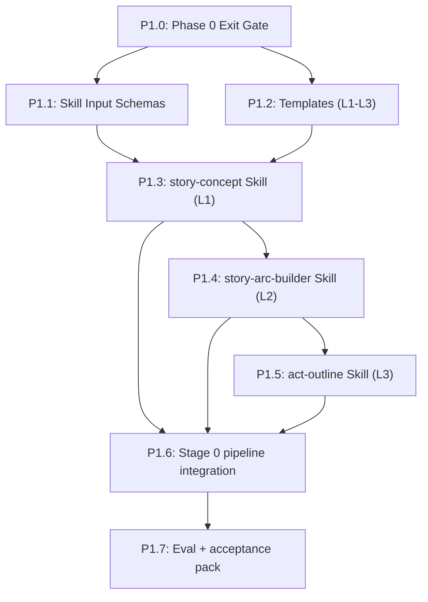

# Phase 1: New Skills (Levels 1–3) — Detailed Plan

## Build Order & Dependencies



**Critical path**: P1.0 → P1.1 → P1.3 → P1.4 → P1.5 → P1.6 → P1.7

**Parallel track**: P1.1 and P1.2 can proceed in parallel after P1.0.

---

## P1.0: Phase 0 Exit Gate (Hard Prerequisite)

**Goal**: Block Phase 1 until foundation contracts and canonical layout are stable.

### Required green checks
- `python scripts/validate_coauthor_setup.py --root .` — all 14 checks pass
- `python scripts/schema_validator.py --all` — all schemas parse
- `python scripts/relationship_query.py --validate --file canon/relationships.yaml` — validates clean
- `pytest tests/test_no_bible_refs.py` — no stale `bible/` references anywhere in repo
- `.pipeline-state.yaml` exists at project root and validates against `schemas/pipeline_state.schema.yaml`

### Pass criteria
- All automated checks pass locally (CI optional at this stage).
- Phase 0 commit `phase0/s0.6` tag exists.

---

## P1.1: Skill Input Schemas

**Goal**: Define strict input contracts for the three new skills.

### Schema Architecture

The generic `node_input.schema.yaml` remains unchanged — it defines the envelope (step, level, context_files, instructions). Skill-specific parameters are defined in **separate schema files**, one per skill. The skill schemas validate the structured inputs that go inside the `instructions` field or are passed alongside it.

### Files to create/modify
| File | Purpose |
|------|---------|
| [NEW] `schemas/story_concept_input.schema.yaml` | Skill-specific params for story-concept |
| [NEW] `schemas/story_arc_input.schema.yaml` | Skill-specific params for story-arc-builder |
| [NEW] `schemas/act_outline_input.schema.yaml` | Skill-specific params for act-outline |
| [MODIFY] `tests/test_schemas.py` | Add tests for new skill-specific schemas |
| [NEW] `examples/phase1/valid_concept_input.yaml` | Valid story-concept input example |
| [NEW] `examples/phase1/valid_arc_input.yaml` | Valid story-arc-builder input example |
| [NEW] `examples/phase1/valid_outline_input.yaml` | Valid act-outline input example |

### Required fields per skill schema

**story_concept_input.schema.yaml**:
- `genre` (string, required) — primary genre
- `protagonist` (string, required) — protagonist name or brief description
- `inciting_situation` (string, required) — what disrupts the status quo
- `comparable_titles` (array of strings, optional) — reference works for tone/scope
- `world_premise` (string, optional) — world context if speculative fiction
- `target_length` (string, optional) — word count target (e.g., "80,000 words")

**story_arc_input.schema.yaml**:
- `concept_file` (string, required) — path to `canon/story-concept.md`
- `target_scope` (string, optional, default: "full_story") — what to arc over
- `act_count` (integer, optional, default: 4) — number of acts (3 or 4)
- `character_files` (array of strings, optional) — paths to character profiles

**act_outline_input.schema.yaml**:
- `arc_file` (string, required) — path to `canon/story-arc.md`
- `act_number` (integer, required, minimum: 1) — which act to outline
- `chapter_count_hint` (integer, optional) — suggested chapter count for this act

### TDD checks
- `story_concept_input` missing `genre` → fails
- `story_concept_input` missing `protagonist` → fails
- `story_arc_input` missing `concept_file` → fails
- `act_outline_input` missing `act_number` → fails
- `act_outline_input` with `act_number: 0` → fails (minimum: 1)
- All valid examples pass validation

### Pass criteria
- `pytest tests/test_schemas.py` passes (including new tests).
- CLI validator accepts valid examples and rejects malformed inputs.

---

## P1.2: Templates (L1–L3)

**Goal**: Lock output structure before skill implementation.

### Files to create
| File | Purpose |
|------|---------|
| [NEW] `templates/story-concept.template.md` | L1 one-pager structure |
| [NEW] `templates/story-arc.template.md` | L2 arc structure |
| [NEW] `templates/act-outline.template.md` | L3 act chapter structure |
| [NEW] `tests/test_templates.py` | Verify required sections and headers |
| [NEW] `examples/phase1/l1_story-concept.example.md` | Golden sample (manual reference) |
| [NEW] `examples/phase1/l2_story-arc.example.md` | Golden sample (manual reference) |
| [NEW] `examples/phase1/l3_act-outline.example.md` | Golden sample (manual reference) |

### Template conventions
- Use `<!-- instruction -->` HTML comment syntax for placeholders (consistent with existing templates like `story-bible.template.md`).
- Every template must have a level-1 heading (`# Title`) and required section headings as level-2 (`## Section`).
- All templates include a `## Sources` section at the end for file-cited reasoning.

### Required structure

**L1 (story-concept.template.md)** — required sections:
- `## Premise` — core concept in 1-2 paragraphs
- `## Genre` — primary and secondary genre
- `## Controlling Idea` — theme statement in "Value is achieved/lost when condition" format
- `## Central Dramatic Question` — the question that drives the narrative
- `## Stakes` — what is at risk, for whom, why it matters
- `## Story Promise` — incorporates output from `story-promise` skill (see P1.3 note)
- `## Point of View` — POV type, protagonist, other POV characters
- `## Setting` — time, place, technology level
- `## Target Scope` — word count, chapter count targets
- `## Sources`

**L2 (story-arc.template.md)** — required sections:
- `## Arc Overview` — one-paragraph summary of the full story arc
- `## Act Progression` — 4-part structure (Act 1, Act 2A, Act 2B, Act 3) with act-level beats
- `## Character Trajectories` — per-character arc across all acts (start state → end state)
- `## Subplot Map` — subplot threads with act-level touchpoints
- `## Thematic Pressure Points` — where theme is tested/challenged per act
- `## Open Questions` — unresolved design decisions to be addressed in act outlines
- `## Sources`

**L3 (act-outline.template.md)** — required sections:
- `## Act Overview` — act-level summary, dramatic function
- `## Chapter List` — ordered chapters with:
  - Title/number
  - Beat intent (what must happen in this chapter)
  - Value shift (polarity change: e.g., safety → danger)
  - Causal dependency (what prior chapter event enables this one)
  - Key characters present
- `## Continuity Touchpoints` — entities, facts, and timeline constraints this act must respect
- `## Open Questions` — items needing resolution before chapter-level work
- `## Sources`

### Template conformance test approach
`tests/test_templates.py` verifies:
1. Each template file exists and is non-empty.
2. Each template contains all required `##` headings for its level.
3. Golden examples also contain all required headings (ensures examples stay in sync).

### Pass criteria
- `pytest tests/test_templates.py` passes.
- Golden examples contain all required headings and demonstrate the expected structure.

---

## P1.3: `story-concept` Skill (L1)

**Goal**: Generate normalized concept artifact at `canon/story-concept.md`.

### Relationship to `story-promise` skill

The existing `story-promise` skill defines the reader-facing narrative promise (central question, stakes, promise statement). The new `story-concept` skill produces a broader artifact that **includes** the story promise as one section. The workflow is:

1. User runs `story-concept` with genre, protagonist, inciting situation.
2. The `story-concept` skill internally invokes/incorporates the `story-promise` output.
3. The resulting `canon/story-concept.md` contains a `## Story Promise` section populated from the story-promise framework.

The `story-promise` skill remains available standalone for cases where the user wants to refine the promise independently after the concept exists.

### Files to create
| File | Purpose |
|------|---------|
| [NEW] `.claude/skills/story-concept/SKILL.md` | Skill definition (YAML frontmatter + markdown) |
| [NEW] `tests/test_skill_concept.py` | Skill-level integration checks |

### Skill SKILL.md format

Must follow the existing convention (see `voice-anchor`, `scene-architect`, etc.):
```yaml
---
name: Story Concept
description: Generate a structured story concept artifact at L1.
---
```
Followed by markdown with Usage, Process (Inputs/Steps), Output Format, Quality Checks sections.

### Skill logic
1. Validate input against `story_concept_input` schema.
2. Load `templates/story-concept.template.md` for output structure.
3. Load canon references if present: `canon/world/story-bible.md`, `canon/preferences.md`.
4. Incorporate `story-promise` framework (central question, stakes, promise statement).
5. Generate filled concept artifact conforming to template headings.
6. Write to `canon/story-concept.md`.
7. Update `canon/relationships.yaml` with protagonist entity and aliases via `relationship_query.py add` (or instruct the user to run the command).
8. Advance `.pipeline-state.yaml` position to `level: L2` (ready for next step).

### Relationship update mechanism
When the skill produces a protagonist entity, it should output a ready-to-run command:
```bash
python scripts/relationship_query.py add --file canon/relationships.yaml \
  --from protagonist_id --to [target] --rel [rel_type] \
  --context "introduced in story concept" --established L1/concept
```
Or, if the skill is invoked programmatically, the pipeline wrapper calls `relationship_query.py` directly. For manual mode, the skill's output includes the command for the user to execute.

### Test approach (`tests/test_skill_concept.py`)
These tests verify the Python plumbing and structural contracts, NOT LLM output quality:
- Template file exists and is loadable.
- Schema validation rejects malformed inputs.
- A mock/sample concept output contains all required template headings.
- The output path (`canon/story-concept.md`) is correct per the template.

### Pass criteria
- Skill discoverable via `/project:skills:story-concept`.
- Skill SKILL.md follows YAML frontmatter + markdown convention.
- Valid input produces template-conformant output (all required `##` headings present).
- Missing required input prompts for completion rather than writing malformed output.

---

## P1.4: `story-arc-builder` Skill (L2)

**Goal**: Convert concept into arc architecture at `canon/story-arc.md`.

### Files to create
| File | Purpose |
|------|---------|
| [NEW] `.claude/skills/story-arc-builder/SKILL.md` | Skill definition (YAML frontmatter + markdown) |
| [NEW] `tests/test_story_arc_builder.py` | Arc output verification checks |

### Skill logic
1. Load `canon/story-concept.md` (required — fail if missing).
2. Load `canon/relationships.yaml` (entity roster + aliases).
3. Load character profiles from `canon/characters/*.md` if any exist.
4. Load `templates/story-arc.template.md` for output structure.
5. Generate arc: act progression, character trajectories, subplot dependencies, thematic pressure.
6. Write to `canon/story-arc.md`.
7. Add relationship deltas implied by arc via `relationship_query.py add` commands (with `source` citations pointing to `canon/story-arc.md`).
8. Advance `.pipeline-state.yaml` position to `level: L3, act: null` (ready for act outlining).

### Test approach (`tests/test_story_arc_builder.py`)
- Schema validation rejects malformed arc inputs.
- Template file exists and is loadable.
- A mock/sample arc output contains all required template headings.
- Arc output references concept constraints (checks for cross-references).

### Pass criteria
- Output references concept constraints explicitly.
- Character trajectories are traceable across acts (each character has a start/end state per act).
- Open decisions are surfaced in explicit `## Open Questions` block.
- Skill SKILL.md follows YAML frontmatter + markdown convention.

---

## P1.5: `act-outline` Skill (L3)

**Goal**: Produce per-act chapter-level outlines at `canon/acts/act-{N}-outline.md`.

### Files to create
| File | Purpose |
|------|---------|
| [NEW] `.claude/skills/act-outline/SKILL.md` | Skill definition (YAML frontmatter + markdown) |
| [NEW] `tests/test_act_outline_skill.py` | Outline structural + continuity checks |

### Skill logic
1. Validate `act_number` input against `act_outline_input` schema.
2. Load `canon/story-arc.md` (required — fail if missing).
3. Load `templates/act-outline.template.md` for output structure.
4. Load sibling act outlines if they exist (for cross-act awareness, via context loader rules).
5. Expand selected act into chapter outlines.
6. Write to `canon/acts/act-{N}-outline.md`.
7. Populate `## Continuity Touchpoints` section with entities and facts that downstream chapters must respect. (This is a structured section in the output, not a sidecar call — the continuity agent sidecar is built in Phase 3.)
8. Advance `.pipeline-state.yaml` position to `level: L3, act: N` (or remain at L3 if more acts to outline).

### Test approach (`tests/test_act_outline_skill.py`)
- Schema validation rejects malformed outline inputs (missing act_number, act_number < 1).
- Template file exists and is loadable.
- A mock/sample act outline contains all required template headings.
- Chapter list has ordered entries with beat intent and value-shift markers.

### Pass criteria
- Ordered chapter list with beat intent and value-shift markers.
- At least one causal dependency per chapter.
- No hidden placeholders (only explicit `## Open Questions` sections allowed).
- Skill SKILL.md follows YAML frontmatter + markdown convention.

---

## P1.6: Integrate Stage 0 into `pipeline-run`

**Goal**: Wire L1→L2→L3 into the documented pipeline with required human pauses and state management.

### Files to modify
| File | Change |
|------|--------|
| [MODIFY] `.claude/commands/pipeline-run.md` | Add Stage 0 (Steps 0A/0B/0C) before existing Stage 1, with review pauses |
| [MODIFY] `CLAUDE.md` | Add new skill references + output paths under Key Directories and Primary Commands |
| [MODIFY] `README.md` | Add "Stage 0: Story Development" to getting-started section |
| [MODIFY] `.pipeline-state.yaml` | Document state transitions for L1→L2→L3 |

### Pipeline state advancement

The pipeline state must be updated at each step boundary. In manual mode, this is done by the skill (or the user) editing `.pipeline-state.yaml`:

| After step | New position | Notes |
|------------|-------------|-------|
| story-concept complete | `level: L2, act: null` | Ready for arc building |
| story-arc-builder complete | `level: L3, act: null` | Ready for act outlining |
| act-outline(N) complete | `level: L3, act: N` | Ready for next act or advance to L4 |
| All acts outlined | `level: L4, act: 1, chapter: null` | Ready for chapter planning (Stage 1) |

Each skill's SKILL.md should include a "State Update" section documenting the expected state transition. In manual mode, the user confirms the state change. In future pipeline automation (Phase 4), the orchestrator handles this.

### Resolve state file location conflict

The existing `pipeline-run.md` references `{scene-directory}/.pipeline-state` (per-scene state). Phase 0 established a project-root `.pipeline-state.yaml`. Resolution: **project-root `.pipeline-state.yaml` is the single source of truth** for pipeline position. Remove the per-scene reference from `pipeline-run.md`.

### Required Stage 0 flow in `pipeline-run.md`

```
Stage 0: Story Development (NEW)
  Step 0A: story-concept → canon/story-concept.md
    State: L1 → L2
    PAUSE: Human review of concept
  Step 0B: story-arc-builder → canon/story-arc.md
    State: L2 → L3
    PAUSE: Human review of arc
  Step 0C: act-outline (per act) → canon/acts/act-N-outline.md
    State: L3 (advance act pointer)
    PAUSE: Human review of all act outlines before Stage 1

Stage 1: Chapter Planning (existing, unchanged)
Stage 2: Drafting (existing, unchanged)
Stage 3: Revision (existing, unchanged)
```

### Pass criteria
- Stage 0 docs match actual skill invocation flow.
- `pipeline-run.md` no longer references per-scene `.pipeline-state`.
- State transitions are documented per step.
- `pytest tests/test_no_bible_refs.py` still passes (no regressions).

---

## P1.7: Eval + Acceptance Pack

**Goal**: Prove Phase 1 is stable and ready for Phase 2A.

### Files to create
| File | Purpose |
|------|---------|
| [NEW] `docs/phase1_acceptance_checklist.md` | Hard completion gate |
| [NEW] `traces/phase1-smoke.trace.md` | One full Stage 0 trace (hand-written during manual run) |

### Smoke trace specification

The smoke trace is **hand-written during a manual end-to-end run** of Stage 0. It documents:
- Timestamp, model used, context files loaded per step.
- Inputs provided at each step (concept → arc → outline).
- Whether output conformed to template headings (pass/fail per heading).
- Relationship updates performed.
- State transitions observed in `.pipeline-state.yaml`.
- Any issues encountered and resolutions.

This is a narrative record, not an automated trace. Automated trace recording (JSON + rendered markdown) is deferred to Phase 2B when the orchestrator exists.

### Automated verification
```bash
# Foundation checks
python scripts/validate_coauthor_setup.py --root .
python scripts/schema_validator.py --all

# All tests
pytest tests/test_schemas.py tests/test_templates.py tests/test_skill_concept.py tests/test_story_arc_builder.py tests/test_act_outline_skill.py tests/test_no_bible_refs.py

# Relationship integrity
python scripts/relationship_query.py --validate --file canon/relationships.yaml
```

### Manual verification
1. Run L1 → L2 → L3 on a new concept (fresh story).
2. Verify human pause points after each step.
3. Verify artifact paths match expected locations.
4. Verify each output contains all required template headings.
5. Verify `.pipeline-state.yaml` level advances correctly at each step.
6. Run one revision/rerun loop on a single step and confirm state remains valid.

### Phase 1 completion criteria
- End-to-end run succeeds and writes:
  - `canon/story-concept.md`
  - `canon/story-arc.md`
  - `canon/acts/act-1-outline.md` (or selected act)
- All outputs conform to their templates (required `##` headings present).
- Relationship data updates from L1/L2 where applicable.
- `.pipeline-state.yaml` correctly reflects L3 position after full run.
- Acceptance checklist is green.
- All automated tests pass.

---

## Risk Register

| Risk | Impact | Mitigation |
|------|--------|------------|
| Inconsistent markdown output | High | Template-first design + heading conformance tests |
| Weak arc reasoning at low-cost tiers | Medium | Model floor for L1-L3 critical nodes (sonnet for depth_partner, character_specialist) |
| Migration residue (`bible/` refs) | High | `test_no_bible_refs.py` regression test in P1.0 and P1.7 |
| Prompt drift across new skills | Medium | Shared YAML frontmatter convention + schema validation |
| Unclear stage completion | High | Hard acceptance checklist + manual smoke trace |
| story-promise / story-concept overlap | Medium | story-concept incorporates story-promise as a section; both remain independently invocable |
| Skill output doesn't conform to template | High | `test_templates.py` defines required headings; skill tests verify mock outputs match |

---

## Commit Strategy

| Commit | Tag |
|--------|-----|
| `phase1: add skill input schemas for L1-L3` | `phase1/p1.1` |
| `phase1: add L1-L3 templates and template tests` | `phase1/p1.2` |
| `phase1: add story-concept skill` | `phase1/p1.3` |
| `phase1: add story-arc-builder skill` | `phase1/p1.4` |
| `phase1: add act-outline skill` | `phase1/p1.5` |
| `phase1: integrate stage0 into pipeline-run docs` | `phase1/p1.6` |
| `phase1: add acceptance checklist and smoke trace` | `phase1/p1.7` |

---

## Definition of Done (Phase 1)

- [ ] L1/L2/L3 skills are implemented, invocable, and follow YAML frontmatter convention.
- [ ] All three skills produce output conforming to their templates.
- [ ] Stage 0 is integrated into `pipeline-run.md` with state transitions documented.
- [ ] `.pipeline-state.yaml` advances correctly through L1→L2→L3.
- [ ] Input schemas validate all three skill inputs with proper required fields.
- [ ] Template tests + skill tests + no-bible-refs tests all pass.
- [ ] `story-concept` incorporates `story-promise` framework.
- [ ] One successful end-to-end Stage 0 run is traced and reviewable.
- [ ] All git tags applied per commit strategy.
- [ ] Ready to proceed to Phase 2A simulated MOE.
