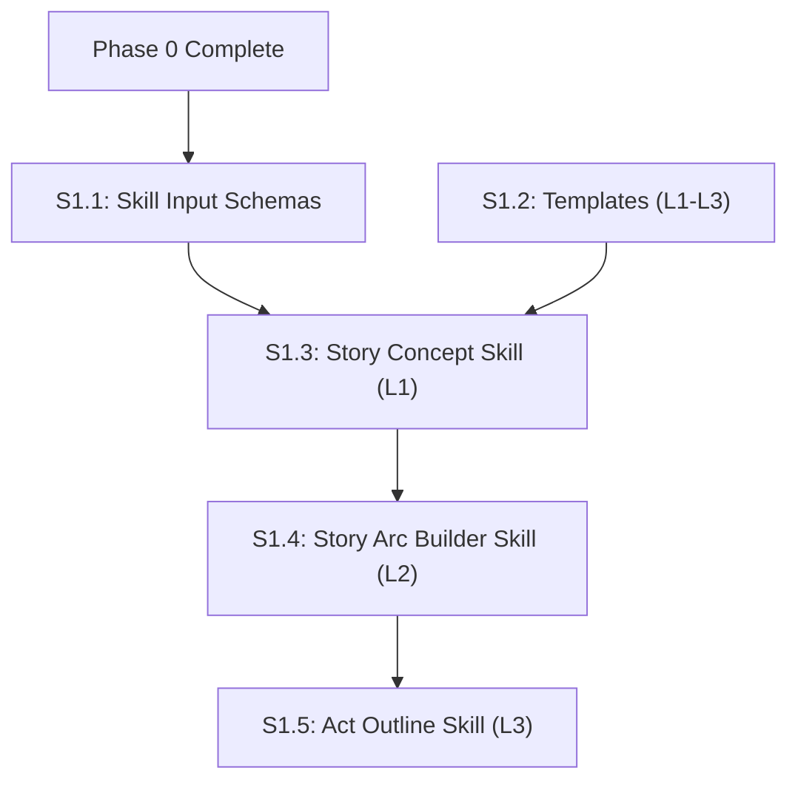

# Phase 1: New Skills (Levels 1-3) — Detailed Plan

## Build Order & Dependencies



**Critical path**: S1.1 → S1.2 → S1.3 → S1.4 → S1.5. Skills build sequentially as L1 output feeds L2 input.

---

## S1.1: Skill Input Schemas

**Goal**: Define strict I/O contracts for the new skills, extending the base `node_input` schema from Phase 0.

### Files to Modify/Create

| File | Purpose |
|------|---------|
| [MODIFY] `schemas/node_input.schema.yaml` | Add specific definitions for `story-concept`, `story-arc`, `act-outline` inputs |
| [MODIFY] `tests/test_schemas.py` | Add validation tests for these specific skill inputs |

### TDD Approach

```python
# tests/test_schemas.py

def test_story_concept_input_valid():
    """Story concept requires genre, protagonist sketch, internal/external conflict."""
    input_data = {
        "skill": "story-concept",
        "genre": "Science Fiction",
        "protagonist": "Elena, 30s, ex-military",
        "inciting_situation": "Finds a signal from the dead zone"
    }
    assert validate("node_input", input_data).ok

def test_story_arc_input_requires_concept_file():
    """Arc builder needs the L1 concept file path."""
    input_data = {
        "skill": "story-arc-builder",
        "concept_file": "canon/story-concept.md"
    }
    assert validate("node_input", input_data).ok
```

### Pass Criteria
- `pytest tests/test_schemas.py` passes
- Schema validator rejects `story-concept` call missing "genre"
- Schema validator rejects `act-outline` call missing "act_number"

---

## S1.2: Templates (L1-L3)

**Goal**: Create the markdown templates that define the output structure for each level. These templates ensure the AI fills in the blanks correctly.

### Files to Create

| File | Purpose |
|------|---------|
| [NEW] `templates/story-concept.template.md` | L1: 1-pager format (concept, stakes, central question) |
| [NEW] `templates/story-arc.template.md` | L2: 4-Act structure, character arc table, subplot list |
| [NEW] `templates/act-outline.template.md` | L3: Chapter list with beats, value shifts, polarity |
| [NEW] `tests/test_templates.py` | Verify templates exist and contain required headers |

### TDD Approach

```python
# tests/test_templates.py

def test_concept_template_headers():
    """L1 template must have specific sections."""
    content = load_template("story-concept.template.md")
    assert "## Core Concept" in content
    assert "## Controlling Idea" in content
    assert "## Central Dramatic Question" in content

def test_arc_template_structure():
    """L2 template must outline 4 acts (Story Grid standard)."""
    content = load_template("story-arc.template.md")
    assert "## Act 1: The Beginning Hook" in content
    assert "## Act 2A" in content
    assert "## Act 2B" in content
    assert "## Act 3: The Payoff" in content
```

### Pass Criteria
- `pytest tests/test_templates.py` passes
- Templates are present in `templates/` directory

---

## S1.3: Story Concept Skill (L1)

**Goal**: Implement the Level 1 skill that takes raw ideas and produces the normalized `canon/story-concept.md`.

### Files to Create

| File | Purpose |
|------|---------|
| [NEW] `.claude/skills/story-concept/SKILL.md` | The skill definition (prompt) |
| [NEW] `tests/test_skill_concept.py` | Integration test (mocked LLM or dry-run) |

### Skill Logic (in SKILL.md)
1. load `node_input` (genre, premise, etc.)
2. load `templates/story-concept.template.md`
3. load `canon/world/story-bible.md` (if exists)
4. Model (Sonnet floor) synthesizes inputs into template
5. Output written to `canon/story-concept.md`
6. `relationships.yaml` update: register protagonist (with aliases)

### TDD/Verification

```python
# tests/test_skill_concept.py

def test_concept_skill_definition_valid():
    """Skill definition must match Antigravity skill format."""
    skill = load_skill("story-concept")
    assert "input_schema" in skill
    assert "project:skills:story-concept" in skill.commands
```

### Pass Criteria
- `story-concept` skill is discoverable by Claude
- Running the skill with valid input generates `canon/story-concept.md`
- The output file matches the template structure headers

---

## S1.4: Story Arc Builder Skill (L2)

**Goal**: Level 2 skill. Takes L1 concept + characters and builds the structural arc.

### Files to Create

| File | Purpose |
|------|---------|
| [NEW] `.claude/skills/story-arc-builder/SKILL.md` | Skill definition |

### Skill Logic
1. Load `canon/story-concept.md` (L1 output)
2. Load `canon/relationships.yaml` (character list)
3. Load `templates/story-arc.template.md`
4. Model (Sonnet floor) maps concept to 4-Act structure
5. Output written to `canon/story-arc.md`
6. `relationships.yaml` update: add key relationships defined in arc (e.g. antagonist connection)

---

## S1.5: Act Outline Skill (L3)

**Goal**: Level 3 skill. Takes L2 arc and breaks one act into chapter outlines.

### Files to Create

| File | Purpose |
|------|---------|
| [NEW] `.claude/skills/act-outline/SKILL.md` | Skill definition |

### Skill Logic
1. Input: `act_number` (1, 2a, 2b, 3)
2. Load `canon/story-arc.md` (L2 output)
3. Load `templates/act-outline.template.md`
4. Model extracts specific act's summary from L2
5. Expands summary into chapter list (beats, value shift)
6. Output written to `canon/acts/act-{N}-outline.md`

### Pass Criteria (Phase 1 Complete)
- End-to-end test:
  1. Run `story-concept` → `canon/story-concept.md` created
  2. Run `story-arc-builder` → `canon/story-arc.md` created
  3. Run `act-outline 1` → `canon/acts/act-1-outline.md` created
- All outputs validate against their templates
- `relationships.yaml` gets populated with entities from these steps
