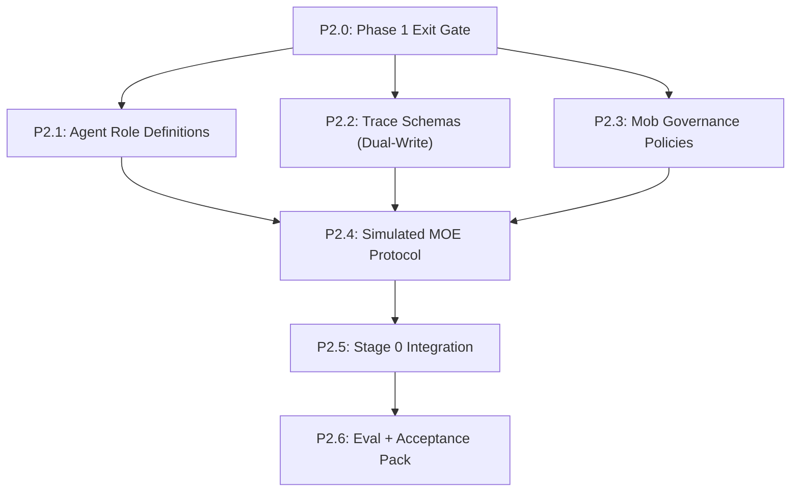

# Phase 2A: Simulated MOE (MVP) — Detailed Plan

## Build Order & Dependencies



**Critical path**: P2.0 → P2.1 → P2.2 → P2.3 → P2.4 → P2.6.

---

## P2.0: Phase 1 Exit Gate (Hard Prerequisite)

**Goal**: Ensure L1-L3 skills are stable before layering orchestration on top.

### Required green checks
- `python scripts/validate_coauthor_setup.py --root .`
- `pytest tests/test_skill_concept.py`
- `grep -ri "bible/" .claude/skills` returns nothing (full migration).
- **Smoke Trace**: A Phase 1 end-to-end run (`phase1-smoke.trace.md`) exists and is structurally valid.

### Pass criteria
- All tests pass.
- `.pipeline-state.yaml` exists and tracks L1-L3 nodes correctly.

---

## P2.1: Agent Role Definitions

**Goal**: Define the system prompts for the MOE Mob agents.

### Files to create
| File | Purpose |
|------|---------|
| [NEW] `agents/lead-editor.md` | Orchestrator: manages turns, formatting, consensus |
| [NEW] `agents/plot-analyst.md` | Specialist: structure, stakes, causality |
| [NEW] `agents/character-specialist.md` | Specialist: voice, motivation, arc integrity |
| [NEW] `agents/depth-partner.md` | Specialist: theme, philosophy, meaning |
| [NEW] `agents/continuity-agent.md` | Specialist: facts, timeline, entity consistency |
| [NEW] `tests/test_agents.py` | Verify agent definitions exist and contain required sections |

### TDD Approach
```python
# tests/test_agents.py
def test_lead_editor_has_orchestration_rules():
    prompt = load_agent("lead-editor")
    assert "Role-Switching Protocol" in prompt
    assert "Consensus Tracking" in prompt

def test_continuity_agent_has_tool_defs():
    prompt = load_agent("continuity-agent")
    assert "relationships.yaml" in prompt
```

### Pass criteria
- All agent files exist in `agents/`.
- Lead Editor prompt explicitly includes the "Simulated MOE" protocol instructions.

---

## P2.2: Trace Schemas (Dual-Write)

**Goal**: Implement the M2 finding (dual-write JSON + MD) for traces.

### Files to create/modify
| File | Purpose |
|------|---------|
| [NEW] `schemas/trace_record.schema.yaml` | JSON schema for the `.trace.json` file |
| [NEW] `templates/trace.template.md` | Markdown template for rendering the view |
| [NEW] `scripts/trace_renderer.py` | Utility: `render(json_path) -> md_path` |
| [MODIFY] `tests/test_schemas.py` | Add trace schema validation |

### TDD Approach
```python
# tests/test_trace_renderer.py
def test_render_creates_markdown_from_json():
    data = load_fixture("valid_trace.json")
    md = trace_renderer.render(data)
    assert "# Trace:" in md
    assert "**Timestamp**" in md
    assert "<!-- HUMAN-EVAL" in md  # M2 requirement
```

### Pass criteria
- Schema validates a sample trace JSON.
- Renderer produces Markdown that matches the design doc format.

---

## P2.3: Mob Governance Policies

**Goal**: Implement the C5 (Termination) and M5 (Citation) policies in the pipeline state.

### Files to modify
| File | Purpose |
|------|---------|
| [MODIFY] `.pipeline-state.yaml` | Add `mob_config` section |
| [MODIFY] `schemas/pipeline_state.schema.yaml` | Validate `mob_config` fields |

### Configuration Structure
```yaml
mob_config:
  max_rounds: 3
  budget_cap_usd: 1.00
  diminishing_return_threshold: 0  # accepted deltas
  mandatory_decision_after: 3
```

### Pass criteria
- `.pipeline-state.yaml` includes default governance config.
- Validator accepts valid config, rejects missing fields.

---

## P2.4: Simulated MOE Protocol (Lead Editor)

**Goal**: The core of Phase 2A. A "Simulated MOE" where the Lead Editor role-switches within a single session.

### Files to create
| File | Purpose |
|------|---------|
| [NEW] `.claude/commands/skills/mob-session/SKILL.md` | The "skill" that starts a mob session |

### Protocol Logic (in SKILL.md + Lead Editor prompt)
1. User invokes `/mob-session {node}`.
2. Skill loads `agents/` definitions into context.
3. Skill loads `context_manifest` (content).
4. **Lead Editor** takes control:
   - "Round 1 Start"
   - Calls on **Plot Analyst**: "Review this text for structural issues."
   - (Simulated): "Speaking as Plot Analyst..." → critique.
   - Calls on **Character Specialist**: "Review for voice."
   - (Simulated): "Speaking as Character Specialist..." → critique.
   - **Lead Editor**: Synthesizes comments, presents to user.
   - User responds (Accept/Reject/Edit).
5. **Lead Editor** checks Governance (P2.3):
   - Max rounds reached?
   - Diminishing returns?
   - "Continue to Round 2 or Commit?"

### Pass criteria
- Running `/mob-session` starts a multi-turn critique loop.
- Lead Editor correctly adopts sub-agent personas.
- Governance rules trigger a "Commit or Park" prompt after 3 rounds.

---

## P2.5: Stage 0 Integration

**Goal**: Wire the mob session into the pipeline workflow.

### Files to modify
| File | Purpose |
|------|---------|
| [MODIFY] `.claude/commands/pipeline-run.md` | Update Stage 0 to usage `mob-session` instead of raw skills |
| [MODIFY] `README.md` | Update workflow documentation |

### Pass criteria
- Documentation reflects the new Mob-based workflow for L1-L3.

---

## P2.6: Eval + Acceptance Pack

**Goal**: Prove Phase 2A works and generates usable trace data.

### Files to create
| File | Purpose |
|------|---------|
| [NEW] `docs/phase2a_acceptance_checklist.md` | Hard completion gate |
| [NEW] `traces/phase2a-smoke.trace.json` | Generated machine trace |
| [NEW] `traces/phase2a-smoke.trace.md` | Rendered human view |

### Verification Steps
1. **End-to-End Run**:
   - Start at L2 (Arc Builder).
   - Invoke `/mob-session`.
   - Complete 2 rounds of critique.
   - Commit changes.
2. **Trace Verification**:
   - `trace.json` exists and contains all comments/actions.
   - `trace.md` is rendered and readable.
   - `human-eval` templates are present in the MD.
3. **Governance Check**:
   - Force a 4-round session → verify Lead Editor forces a decision.

### Phase 2A Completion Criteria
- Simulated MOE works in a single session.
- Traces are dual-written (JSON+MD).
- Governance rules prevent infinite loops.
- Acceptance checklist is green.

---

## Risk Register

| Risk | Impact | Mitigation |
|------|--------|------------|
| Context window overflow | High | Phase 2A is single-session; stricter context limits in `context_loader`. |
| Persona bleed | Medium | specialized system prompts for each agent. |
| Trace data loss | High | JSON source-of-truth written *after every turn*. |
| Governance ignored | Medium | Lead Editor prompt emphasizes "Role: Strict Moderator". |

---

## Commit Strategy
1. `phase2a: add agent role definitions`
2. `phase2a: add trace schema and renderer`
3. `phase2a: add mob governance to pipeline-state`
4. `phase2a: implement mob-session skill`
5. `phase2a: update pipeline docs`
6. `phase2a: add acceptance pack and smoke trace`
