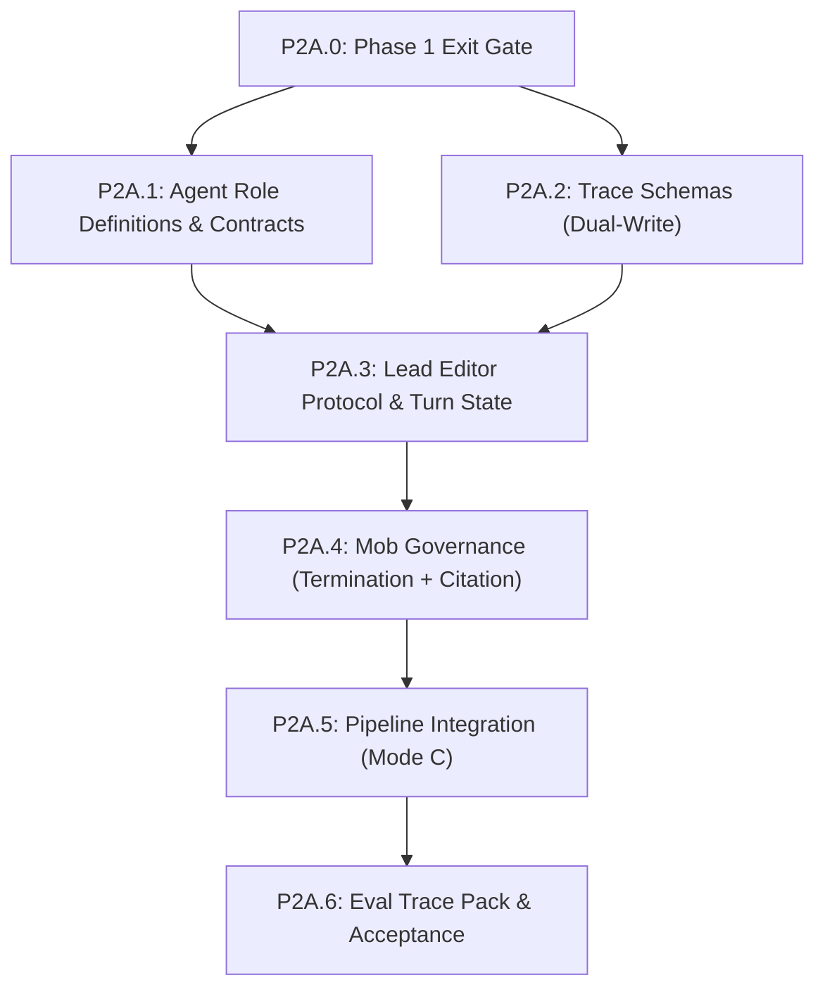

# Phase 2A: Simulated MOE (MVP) — Detailed Plan

## Build Order & Dependencies



**Critical path**: P2A.0 → P2A.1 → P2A.2 → P2A.3 → P2A.4 → P2A.6

---

## P2A.0: Phase 1 Exit Gate (Hard Prerequisite)

**Goal**: Block Phase 2A until Stage 0 artifacts and contracts are stable enough for multi-agent critique loops.

### Required green checks
- `python scripts/validate_coauthor_setup.py --root .`
- `pytest tests/test_schemas.py`
- `pytest tests/test_skill_concept.py`
- **Smoke Trace**: A Phase 1 end-to-end run (`phase1-smoke.trace.md`) exists and is structurally valid.
- **Artifact Check**: `canon/story-concept.md`, `canon/story-arc.md` exist and validate.

### Pass criteria
- All checks pass locally.
- No unresolved placeholder sections in Stage 0 artifacts.

---

## P2A.1: Agent Role Scaffolding & Shared Contract

**Goal**: Define strict role boundaries so simulated MOE stays coherent in one-session role switching.

### Files to create
| File | Purpose |
|------|---------|
| [NEW] `agents/lead-editor.md` | Orchestrator role, protocol owner, output formatter |
| [NEW] `agents/plot-analyst.md` | Structure/causality/tension specialist |
| [NEW] `agents/character-specialist.md` | Motivation/voice/arc integrity specialist |
| [NEW] `agents/depth-partner.md` | Theme, moral pressure, meaning specialist |
| [NEW] `agents/continuity-agent.md` | Canon fact-check + relationship consistency specialist |
| [NEW] `agents/prose-crafter.md` | Line-level craft specialist (active L4-L5 only) |
| [NEW] `docs/agent_contract.md` | Shared constraints for all agents |
| [NEW] `tests/test_agents.py` | Verify agent definitions against contract |

### Contract Requirements (TDD verified)
- **Scope**: What the agent evaluates (e.g., Plot Analyst: "Causality, Pacing").
- **Out-of-scope**: What they ignore (e.g., Plot Analyst: "Prose style, Grammar").
- **Evidence Rule**: Comments must cite specific lines/files.
- **Escalation Rule**: When to defer to another specialist.

### TDD Approach
```python
# tests/test_agents.py
def test_all_agents_have_scope_definition():
    for agent in ["lead-editor", "plot-analyst", "depth-partner"]:
        prompt = load_agent(agent)
        assert "## Scope" in prompt
        assert "## Out of Scope" in prompt

def test_prose_crafter_restricted_levels():
    prompt = load_agent("prose-crafter")
    assert "Active Levels: L4, L5" in prompt
```

---

## P2A.2: Trace Schemas (Dual-Write)

**Goal**: Implement M2 finding (JSON+MD) for reproducible debuggability.

### Files to create/modify
| File | Purpose |
|------|---------|
| [NEW] `schemas/trace_record.schema.yaml` | JSON schema for `.trace.json` |
| [NEW] `templates/trace.template.md` | Markdown template for `human-eval` view |
| [NEW] `scripts/trace_renderer.py` | Utility: `render(json) -> md` |
| [MODIFY] `tests/test_schemas.py` | Add trace validation |

### Output Example
```json
{
  "step": "L2/Arc",
  "mode": "mob",
  "turns": [
    {
      "agent": "plot-analyst",
      "comment": "Act 2A lacks a pinch point.",
      "citations": ["canon/story-arc.md#L45"],
      "human_decision": "accepted"
    }
  ]
}
```

---

## P2A.3: Lead Editor Protocol & Turn State

**Goal**: Make one-session simulated MOE deterministic and reproducible.

### Files to create
| File | Purpose |
|------|---------|
| [NEW] `.claude/commands/skills/mob-session/SKILL.md` | The skill driving the session |
| [NEW] `docs/moe_mob_protocol.md` | Canonical turn-by-turn rules |

### Protocol Logic (Lead Editor System Prompt)
1. **Round Setup**: State target artifact + objective.
2. **Agent Sequence**: `plot -> character -> depth -> continuity -> prose*`
3. **Single-Turn Discipline**: One agent speaks per turn.
4. **Human Gate**: `accept / reject / revise / park` after *every* comment.
5. **State Log**: Lead Editor maintains a running ledger of decisions.
6. **Round Close**: Summary of accepted deltas vs parked questions.

---

## P2A.4: Mob Governance (Termination + Citation)

**Goal**: Enforce C5 (Termination) and M5 (Citation) policies.

### Files to modify/create
| File | Purpose |
|------|---------|
| [MODIFY] `.pipeline-state.yaml` | Add `mob_config` section |
| [NEW] `docs/citation_enforcement.md` | Rules for `[advisory]` tagging |
| [MODIFY] `agents/lead-editor.md` | Inject termination/citation rules |

### Enforcement Rules
1. **Citation**: Claims without file evidence are auto-tagged `[advisory]` and cannot mutate canon directly.
2. **Termination**:
   - **Max Rounds**: 3 (default). Force "Commit or Park".
   - **Diminishing Returns**: 0 accepted deltas in a round → Prompt to close.
   - **Budget Cap**: (future hook)

---

## P2A.5: Pipeline Integration (Mode C)

**Goal**: Integrate simulated MOE into the standard workflow without breaking Mode A.

### Files to modify
| File | Change |
|------|--------|
| [MODIFY] `.claude/commands/pipeline-run.md` | Add Mode C entry point (`/mob-session`) |
| [MODIFY] `06_COAUTHOR_EXECUTION_RUNBOOK.md` | practical mob sequence instructions |
| [MODIFY] `README.md` | Add "How to run Mob Review" section |

### Workflow
1. Navigate to node (e.g., `L2/Arc`).
2. `pipeline-run --mode mob` (or call `/mob-session`).
3. Lead Editor takes over context.
4. Execute Protocol (P2A.3).
5. Commit changes to canon.
6. Return to Mode A navigation.

---

## P2A.6: Eval Trace Pack & Acceptance

**Goal**: Prove Phase 2A is operational and measurable.

### Files to create
| File | Purpose |
|------|---------|
| [NEW] `docs/phase2a_acceptance_checklist.md` | Hard completion gate |
| [NEW] `traces/phase2a-smoke.trace.json` | Generated machine trace |
| [NEW] `traces/phase2a-smoke.trace.md` | Rendered human view |
| [NEW] `traces/phase2a-failure-modes.trace.md` | Example of advisory/termination handling |

### Evaluation Slices
- **Protocol Adherence**: Did Lead Editor stick to the turn order?
- **Citation Behavior**: Were uncited claims correctly tagged `[advisory]`?
- **Decision Quality**: Ratio of accepted vs rejected comments.
- **Termination**: Did the session end clean on max rounds or consensus?

### Completion Criteria
- Simulated MOE runs in a single session.
- Traces are dual-written.
- Governance rules trigger correctly.
- Acceptance checklist is green.

---

## Risk Register

| Risk | Impact | Mitigation |
|------|--------|------------|
| Context overflow | High | Single-session limit; strict context manifest loading. |
| Persona bleed | Medium | Explicit "Now speaking as X..." separators in Lead Editor prompt. |
| Citation bypass | High | "Citation Check" step added to Protocol before any Commit. |
| Infinite loops | High | Hard max-round stop in Governance config. |
| Human fatigue | Medium | "Park" option available at every turn. |

---

## Commit Strategy
1. `phase2a: add agent role scaffolding`
2. `phase2a: add trace schema and renderer`
3. `phase2a: add lead editor protocol and mob skill`
4. `phase2a: add governance policies (citation/termination)`
5. `phase2a: integrate mode-c into pipeline docs`
6. `phase2a: add acceptance pack and traces`
