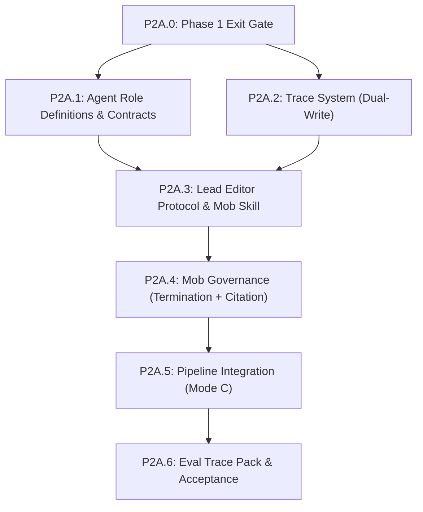

# Phase 2A: Simulated MOE (MVP) — Detailed Plan

## Overview

Phase 2A implements a **single-session simulated Mixture of Experts** where the Lead Editor role-switches through specialist agents within one Claude Code conversation. This avoids the complexity of a multi-process orchestrator (Phase 2B) while validating the protocol, generating trace data, and surfacing where context pollution degrades quality.

**Scope**: The mob session operates on any pipeline level, but P2A smoke testing targets **L1–L3 artifacts** (story concept, arc, act outlines) produced by Phase 1 skills.

**Terminology**: "Mob session" refers to a single Mode C review session where the Lead Editor orchestrates agent role-switching. "Mode A" remains the manual-driver mode with no agent comments.

## Build Order & Dependencies



**Critical path**: P2A.0 → P2A.1 + P2A.2 (parallel) → P2A.3 → P2A.4 → P2A.5 → P2A.6

**Parallel track**: P2A.1 and P2A.2 can proceed in parallel after P2A.0.

---

## P2A.0: Phase 1 Exit Gate (Hard Prerequisite)

**Goal**: Block Phase 2A until Stage 0 skills, schemas, and contracts are stable enough for multi-agent critique loops.

### Required green checks
- `python scripts/validate_coauthor_setup.py --root .` — all 14 checks pass
- `python scripts/schema_validator.py --all` — all 10+ schemas parse
- `python scripts/relationship_query.py --validate --file canon/relationships.yaml` — validates clean
- `pytest tests/` — **all** tests pass (schemas, templates, skills, no-bible-refs, context loader, relationships)
- `.pipeline-state.yaml` exists at project root and validates against `schemas/pipeline_state.schema.yaml`
- **Phase 1 Tag**: Git tag `phase1/p1.7` exists

### Smoke trace gate
- `traces/phase1-smoke.trace.md` exists and is **populated** (not placeholder).
- If the smoke trace is still a placeholder, run one manual Stage 0 end-to-end pass (L1 → L2 → L3) before proceeding. This produces `canon/story-concept.md`, `canon/story-arc.md`, and at least one `canon/acts/act-{N}-outline.md`.

### Pass criteria
- All automated checks pass locally.
- No unresolved placeholder sections in Stage 0 artifacts.
- At least one canon artifact from each L1/L2/L3 level exists (produced by the manual run).

---

## P2A.1: Agent Role Scaffolding & Shared Contract

**Goal**: Define strict role boundaries so simulated MOE stays coherent in one-session role switching.

### Why `agents/` and not `.claude/skills/`

Agent role definitions are **system prompts for role-switching**, not invocable user-facing skills. They live at `agents/` (project root) because:
- Skills have a YAML frontmatter + markdown convention and are discoverable via `/project:skills:*`.
- Agent definitions are loaded internally by the mob session skill, not invoked directly by the user.
- Keeping them separate avoids polluting the skill namespace with non-invocable items.

### Agent definition file format

Each `agents/{name}.md` file must follow this structure:

```markdown
# {Agent Name}

## Role
One-sentence purpose statement.

## Scope
What this agent evaluates (bulleted list).

## Out of Scope
What this agent ignores (bulleted list).

## Active Levels
Which pipeline levels this agent participates in (e.g., L1–L5, or L4–L5 only).

## Evidence Rule
How this agent must support its claims (citation format).

## Escalation Rule
When to defer to another specialist (and which one).

## Model Tier
Default model assignment and any level-specific floors.

## Prompt
The system-prompt text used when the Lead Editor role-switches to this agent.
```

### Files to create
| File | Purpose |
|------|---------|
| [NEW] `agents/lead-editor.md` | Orchestrator role, protocol owner, output formatter |
| [NEW] `agents/plot-analyst.md` | Structure/causality/tension specialist |
| [NEW] `agents/character-specialist.md` | Motivation/voice/arc integrity specialist |
| [NEW] `agents/depth-partner.md` | Theme, moral pressure, meaning specialist |
| [NEW] `agents/continuity-agent.md` | Canon fact-check + relationship consistency specialist |
| [NEW] `agents/prose-crafter.md` | Line-level craft specialist (**active L4–L5 only** — inactive for all P2A smoke tests) |
| [NEW] `docs/agent_contract.md` | Shared constraints for all agents |
| [NEW] `tests/test_agents.py` | Verify agent definitions against contract |

### Contract requirements (TDD verified)

Every agent (except Lead Editor, which has orchestration-specific rules) must include:

| Requirement | Schema field | Verified by |
|-------------|-------------|-------------|
| Scope definition | `## Scope` heading | `test_agents.py` |
| Out-of-scope exclusions | `## Out of Scope` heading | `test_agents.py` |
| Evidence rule | `## Evidence Rule` heading | `test_agents.py` |
| Escalation rule | `## Escalation Rule` heading | `test_agents.py` |
| Active levels | `## Active Levels` heading with level range | `test_agents.py` |
| Model tier | `## Model Tier` heading | `test_agents.py` |
| Output conformance | Comments must be expressible as `agent_comment` schema | `docs/agent_contract.md` |

### Shared contract rules (from `docs/agent_contract.md`)

1. **Cite files, not conversation**: Agents must reference `canon/` paths, never "as we discussed."
2. **One comment per turn**: Each agent speaks exactly once per turn in the queue.
3. **Schema-conformant output**: Every agent comment can be serialized as a valid `agent_comment` schema instance.
4. **Role boundaries**: An agent must not comment on topics in another agent's scope.
5. **Citation-or-advisory**: Claims with `canon/` file evidence are `cited`; claims without are `advisory` (see P2A.4).

### TDD approach (`tests/test_agents.py`)

```python
AGENTS = [
    "lead-editor", "plot-analyst", "character-specialist",
    "depth-partner", "continuity-agent", "prose-crafter",
]
SPECIALIST_AGENTS = [a for a in AGENTS if a != "lead-editor"]

def load_agent(name):
    return (AGENTS_DIR / f"{name}.md").read_text(encoding="utf-8")

def test_all_agent_files_exist():
    for agent in AGENTS:
        assert (AGENTS_DIR / f"{agent}.md").exists()

def test_specialists_have_required_sections():
    for agent in SPECIALIST_AGENTS:
        content = load_agent(agent)
        for heading in ["## Scope", "## Out of Scope", "## Active Levels",
                        "## Evidence Rule", "## Escalation Rule", "## Model Tier"]:
            assert heading in content, f"{agent} missing {heading}"

def test_prose_crafter_restricted_to_l4_l5():
    content = load_agent("prose-crafter")
    assert "L4" in content and "L5" in content
    # Should not be active at L1-L3
    assert "Active Levels" in content

def test_lead_editor_has_protocol_reference():
    content = load_agent("lead-editor")
    assert "Protocol" in content or "protocol" in content

def test_agents_reference_citation_rule():
    for agent in SPECIALIST_AGENTS:
        content = load_agent(agent)
        assert "canon/" in content, f"{agent} missing canon file citation reference"

def test_contract_doc_exists():
    assert (DOCS_DIR / "agent_contract.md").exists()
```

### Pass criteria
- All 6 agent files exist and follow the defined format.
- `docs/agent_contract.md` exists with shared rules.
- `pytest tests/test_agents.py` passes.

---

## P2A.2: Trace System (Dual-Write)

**Goal**: Implement the M2 finding (JSON + rendered MD) for reproducible, debuggable mob sessions.

### Existing infrastructure

The `schemas/trace_record.schema.yaml` **already exists** from Phase 0. This step extends it if needed and builds the rendering/templating layer on top.

### Files to create/modify
| File | Purpose |
|------|---------|
| [MODIFY] `schemas/trace_record.schema.yaml` | Extend if mob-specific fields are missing (rounds array, implicit scores) |
| [MODIFY] `schemas/agent_comment.schema.yaml` | Add `citation_status` field for advisory tagging (see P2A.4) |
| [NEW] `templates/trace.template.md` | Markdown template for rendered human-eval view |
| [NEW] `scripts/trace_renderer.py` | Utility: `render(trace_json_path) -> trace_md_path` |
| [NEW] `tests/test_trace_renderer.py` | Round-trip: JSON → MD, verify structure |
| [MODIFY] `tests/test_schemas.py` | Add tests for `citation_status` field in agent_comment |

### Schema extensions needed

**`agent_comment.schema.yaml`** — add `citation_status` field:
```yaml
citation_status:
  type: string
  enum: ["cited", "advisory"]
  description: "Whether this comment has canon file citations. Auto-derived: cited if citations array is non-empty, advisory otherwise."
```

**`trace_record.schema.yaml`** — verify the existing schema covers:
- `phases.comments` as an array of `agent_comment` objects with `resolution` field (**not** `human_decision` — use the existing schema's terminology)
- `rounds` count or round-level grouping (if not present, add)
- `reproducibility` bundle (already present)

### Trace markdown template structure

The `templates/trace.template.md` renders the JSON source into the format documented in `docs/implementation_plan.md`:

```markdown
# Trace: {step} — Mob Round {round}

**Timestamp**: {timestamp}
**Step**: {step} | **Level**: {level} | **Mode**: {mode}
**Model config**: {model_config summary}

## Context Loaded
<!-- list of files with token estimates -->

## Phase 1: Structure
**Human input**: ...
**Lead Editor output**: ...
**Human accepted**: yes/no | **Adjustments**: ...

## Phase 2: Comments

### {Agent Name} ({model})
**Comment**: ...
**Citations**: ...
**Human response**: ...
**Resolution**: accepted / rejected / deferred / parked
**Citation Status**: cited / advisory
<!-- HUMAN-EVAL: comment-quality=___/5, relevance=___/5 -->

## Artifact Committed
**File**: ...
**Relationships updated**: N new, N changed

## Cost
| Agent | Model | Input tokens | Output tokens | Cost |
|-------|-------|-------------|--------------|------|
```

### Output example (JSON, aligned to existing schemas)

```json
{
  "timestamp": "2026-02-10T16:30:00Z",
  "step": "L2/Arc",
  "level": "L2",
  "mode": "mob",
  "model_config": {
    "lead_editor": "claude-haiku",
    "plot_analyst": "claude-haiku"
  },
  "context_loaded": [
    {"file": "canon/story-concept.md", "tokens": 1204},
    {"file": "canon/story-arc.md", "tokens": 2891}
  ],
  "phases": {
    "structure": {
      "human_input": "...",
      "lead_editor_output": "...",
      "human_accepted": true
    },
    "comments": [
      {
        "agent": "plot_analyst",
        "model": "claude-haiku",
        "comment": "Act 2A lacks a pinch point.",
        "citations": ["canon/story-arc.md#L45"],
        "citation_status": "cited",
        "suggested_changes": [],
        "resolution": "accepted"
      }
    ]
  },
  "cost": {
    "total_usd": 0.008,
    "by_agent": {}
  }
}
```

### TDD approach (`tests/test_trace_renderer.py`)
- Renderer produces markdown from a valid JSON trace fixture.
- Rendered markdown contains all required section headings.
- Agent comments appear in rendered output with correct resolution labels.
- Empty/minimal trace renders without error.
- Round-trip: rendered markdown can be parsed back for `<!-- HUMAN-EVAL: ... -->` annotations.

### Pass criteria
- `trace_renderer.py render(json_path)` produces valid markdown.
- Updated schemas validate correctly (`pytest tests/test_schemas.py`).
- Trace JSON fixture passes `trace_record` schema validation.

---

## P2A.3: Lead Editor Protocol & Mob Session Skill

**Goal**: Make one-session simulated MOE deterministic and reproducible.

### Files to create
| File | Purpose |
|------|---------|
| [NEW] `.claude/skills/mob-session/SKILL.md` | The skill driving the mob session |
| [NEW] `docs/mob_protocol.md` | Canonical turn-by-turn rules (supersedes relevant sections of `docs/human_in_the_loop_design.md`) |
| [NEW] `tests/test_mob_protocol.py` | Protocol structure and state machine tests |

### Skill path convention

The mob session skill is user-invocable (`/project:skills:mob-session`) and follows the standard `.claude/skills/{name}/SKILL.md` convention with YAML frontmatter:

```yaml
---
name: Mob Session
description: Run a simulated MOE review session on the current pipeline artifact.
---
```

### 4-Phase protocol (from design docs)

The protocol follows the 4-phase structure established in `docs/human_in_the_loop_design.md` and `docs/context_continuity_models.md`:

#### Phase 1: Structure Offer
1. Lead Editor reads the current artifact (or receives raw human input).
2. Lead Editor organizes input into the step's output format (using the appropriate template).
3. Human responds: `accept` / `adjust` / `override` ("I'll write it myself") / `skip` ("already structured").

#### Phase 2: Comment Queue
1. Lead Editor announces: **"Now speaking as {Agent Name}..."** (explicit role-switch separator).
2. Agent raises ONE comment with citations.
3. Human responds: `accept` / `reject` / `revise` / `park`.
4. If not resolved, back-and-forth continues (max 2 exchanges per comment).
5. Lead Editor announces next agent: **"Now speaking as {Next Agent}..."**
6. Repeat for all active agents at this level.

Agent sequence: `plot-analyst → character-specialist → depth-partner → continuity-agent → prose-crafter*`
(*prose-crafter only at L4–L5)

#### Phase 3: Resolution Check
Lead Editor summarizes:
- Accepted deltas (changes made)
- Parked questions (deferred to later)
- Then asks: "Another round, commit, or park?"

Governance rules (P2A.4) apply here — round limits and diminishing returns are checked.

#### Phase 4: Commit
1. Lead Editor writes the canonical artifact to the correct file path.
2. Lead Editor updates `canon/relationships.yaml` with any new/changed relationships (citing artifact).
3. Lead Editor logs decisions as a trace record.
4. State transitions: advance `.pipeline-state.yaml` position as appropriate.

### Context loading for mob sessions

The mob session skill must load context via the existing `context_loader.py` manifest rules:
- System files: `.pipeline-state.yaml`, `canon/preferences.md`
- Parent chain: determined by current level (same rules as Mode A)
- Current artifact: the file being reviewed
- Agent definitions: `agents/*.md` for all active agents at this level

The skill should call `python scripts/context_loader.py` or reference the manifest in `.pipeline-state.yaml` to determine which files to load.

### Role-switch convention

To prevent persona bleed (identified in Risk Register), the Lead Editor must use explicit separators:

```
─── Now speaking as Plot Analyst ───

[Agent's comment here, with canon file citations]

─── End Plot Analyst ───
```

This convention is enforced in the mob-session SKILL.md prompt, not programmatically.

### Turn state tracking

The Lead Editor maintains a running decision ledger within the conversation. At the end of each round, the ledger captures:

```markdown
## Round {N} Ledger
| Agent | Comment Summary | Resolution | Citations |
|-------|----------------|------------|-----------|
| plot-analyst | Act 2A needs pinch point | accepted | canon/story-arc.md#L45 |
| character-specialist | Marcus reaction is generic | rejected | — |
| depth-partner | Prosthetic metaphor could deepen | parked | canon/characters/marcus.md#L15 |
```

This ledger becomes the source data for the trace record written in Phase 4.

### TDD approach (`tests/test_mob_protocol.py`)
- Mob session SKILL.md exists with YAML frontmatter.
- SKILL.md references agent definitions directory.
- SKILL.md documents all 4 phases.
- SKILL.md includes role-switch separator convention.
- SKILL.md references context_loader for context loading.
- Protocol doc (`docs/mob_protocol.md`) exists and contains Phase 1–4 descriptions.

### Pass criteria
- Skill discoverable via `/project:skills:mob-session`.
- SKILL.md follows YAML frontmatter + markdown convention.
- Protocol doc is complete and internally consistent.
- `pytest tests/test_mob_protocol.py` passes.

---

## P2A.4: Mob Governance (Termination + Citation)

**Goal**: Enforce C5 (Termination) and M5 (Citation) policies from the architecture reviews.

### Existing infrastructure

The `mob_config` section **already exists** in `.pipeline-state.yaml` and `pipeline_state.schema.yaml` (built in Phase 0):
```yaml
mob_config:
  max_rounds: 3
  budget_cap_usd: 1.0
  diminishing_return_threshold: 0
```

This step adds citation enforcement rules and injects governance into the Lead Editor's protocol.

### Files to modify/create
| File | Purpose |
|------|---------|
| [MODIFY] `agents/lead-editor.md` | Inject termination + citation enforcement rules |
| [MODIFY] `schemas/agent_comment.schema.yaml` | Add `citation_status` field (if not done in P2A.2) |
| [NEW] `docs/citation_enforcement.md` | Rules for cited vs advisory tagging |
| [MODIFY] `docs/mob_protocol.md` | Add governance section referencing termination rules |
| [NEW] `tests/test_governance.py` | Schema tests for citation_status, governance config validation |

### Citation enforcement rules (from M5)

```
RULE: Only claims with canon/artifact citations can mutate canon.

If citations array is non-empty → citation_status = "cited"
  → Comment CAN drive changes to canon files / relationships.yaml

If citations array is empty → citation_status = "advisory"
  → Comment is tagged [advisory] in the trace
  → Comment CANNOT be committed to canon without the human explicitly overriding
  → Human may still act on advisory comments by adding their own citation

Any uncited claim in the decision ledger is tagged: [advisory, uncited]
Any cited claim is tagged: [cited, source: <file>#L<line>]
```

The Lead Editor enforces this by checking citations before committing any change suggested by an agent comment.

### Termination rules (from C5)

| Condition | Default | Trigger |
|-----------|---------|---------|
| Max rounds reached | 3 | Lead Editor prompts: "Round limit reached. Commit current state, park remaining items, or override limit?" |
| Diminishing returns | 0 accepted deltas in a round | Lead Editor prompts: "No changes accepted this round. Ready to commit?" |
| Budget cap | $1.00/node | **Deferred to Phase 2B** — single-session role-switching cannot track actual API costs. P2A uses round counting only. |

### Budget cap limitation (P2A-specific)

In the simulated MOE (single Claude session), there is no mechanism to track actual token costs per agent role-switch — the entire session is one API call. Budget cap enforcement requires the real orchestrator (Phase 2B) with separate API calls per agent. For P2A, the `budget_cap_usd` field exists in the schema but is **not enforced**. Round limits and diminishing returns are the active governance mechanisms.

### TDD approach (`tests/test_governance.py`)
- `agent_comment` schema accepts `citation_status: "cited"` and `"advisory"`.
- `agent_comment` schema rejects unknown `citation_status` values.
- Empty `citations` array + `citation_status: "cited"` is logically inconsistent (test documents this expectation).
- `mob_config` in pipeline state validates with existing defaults.
- `docs/citation_enforcement.md` exists.

### Pass criteria
- Citation enforcement rules are documented and referenced in Lead Editor prompt.
- `agent_comment.schema.yaml` includes `citation_status` field.
- Termination rules are integrated into `docs/mob_protocol.md`.
- `pytest tests/test_governance.py` passes.

---

## P2A.5: Pipeline Integration (Mode C)

**Goal**: Integrate simulated MOE into the standard workflow without breaking Mode A.

### Files to modify
| File | Change |
|------|--------|
| [MODIFY] `.claude/commands/pipeline-run.md` | Add Mode C entry point: mob-session skill reference |
| [MODIFY] `06_COAUTHOR_EXECUTION_RUNBOOK.md` | Add practical mob sequence instructions (file is at project root, not docs/) |
| [MODIFY] `README.md` | Add "How to run Mob Review" section |
| [MODIFY] `CLAUDE.md` | Add mob-session skill + agents/ to Key Directories |

### Mode switching mechanism

Mode is **per-step, not per-session**. The human can switch at any point:

| User action | Effect |
|-------------|--------|
| Run a Stage 0 skill directly (e.g., `/project:skills:story-concept`) | Mode A — skill executes, no agent comments |
| Run `/project:skills:mob-session` | Mode C — Lead Editor orchestrates the 4-phase protocol |
| Say "just validate this" during a mob session | Exits to Mode A for this step — Lead Editor skips remaining agents |
| Say "let's discuss" after a Mode A step | Enters Mode C — Lead Editor starts Phase 2 (comments) on the artifact just produced |

### Pipeline-run.md additions

Add a "Mode C: Mob Review" section alongside the existing Stage 0-3 flow:

```
### Mode C: Mob Review (Optional, any stage)
At any pipeline step, invoke `/project:skills:mob-session` to run a mob review:
1. Mob session loads context via pipeline state manifest.
2. Follows 4-phase protocol (Structure → Comments → Resolution → Commit).
3. Governance rules apply (max rounds, citation enforcement).
4. On commit, state advances per the same rules as Mode A.
5. Return to normal pipeline navigation.
```

### State transitions during mob sessions

Mob sessions follow the **same state advancement rules** as Mode A skills. The mob session's Phase 4 (Commit) writes the artifact and advances `.pipeline-state.yaml` exactly as the corresponding Stage 0 skill would:

| Mob session on | State after commit |
|----------------|-------------------|
| L1 artifact (story-concept) | `level: L2, act: null` |
| L2 artifact (story-arc) | `level: L3, act: null` |
| L3 artifact (act-outline N) | `level: L3, act: N` |

### Workflow example

```
1. User runs /project:skills:story-concept (Mode A) → produces canon/story-concept.md
2. PAUSE: User reviews output
3. User runs /project:skills:mob-session (Mode C on the concept)
   → Lead Editor loads concept, agents comment, human resolves
   → Revised concept committed, state at L2
4. User runs /project:skills:story-arc-builder (Mode A) → produces canon/story-arc.md
5. User runs /project:skills:mob-session (Mode C on the arc)
   → Agents review the arc, human resolves
6. Continue...
```

### Pass criteria
- Mode C is documented in `pipeline-run.md` without breaking existing Stage 0-3 flow.
- Mode switching is documented per the table above.
- README has a "Mob Review" section.
- `CLAUDE.md` references agents/ directory and mob-session skill.
- `pytest tests/test_no_bible_refs.py` still passes (no regressions).

---

## P2A.6: Eval Trace Pack & Acceptance

**Goal**: Prove Phase 2A is operational and measurable.

### Files to create
| File | Purpose |
|------|---------|
| [NEW] `docs/phase2a_acceptance_checklist.md` | Hard completion gate (detailed below) |
| [NEW] `traces/phase2a-smoke.trace.json` | Machine trace from first mob session |
| [NEW] `traces/phase2a-smoke.trace.md` | Rendered human view (from trace_renderer.py) |
| [NEW] `traces/phase2a-failure-modes.trace.md` | Example traces demonstrating governance |

### Acceptance checklist sections

The `docs/phase2a_acceptance_checklist.md` must include:

**Automated Checks**:
- [ ] `python scripts/validate_coauthor_setup.py --root .` — all checks pass
- [ ] `python scripts/schema_validator.py --all` — all schemas parse (including updated agent_comment)
- [ ] `pytest tests/` — all tests pass (Phase 1 + Phase 2A tests)

**Agent Definitions**:
- [ ] All 6 agent files exist in `agents/`
- [ ] All specialists have required sections (Scope, Out of Scope, Active Levels, etc.)
- [ ] `docs/agent_contract.md` exists with shared rules
- [ ] `pytest tests/test_agents.py` passes

**Trace System**:
- [ ] `templates/trace.template.md` exists
- [ ] `scripts/trace_renderer.py` renders JSON → MD
- [ ] `pytest tests/test_trace_renderer.py` passes

**Protocol**:
- [ ] `.claude/skills/mob-session/SKILL.md` exists with YAML frontmatter
- [ ] `docs/mob_protocol.md` exists with 4-phase description
- [ ] Mob session is discoverable via `/project:skills:mob-session`
- [ ] `pytest tests/test_mob_protocol.py` passes

**Governance**:
- [ ] `agent_comment.schema.yaml` includes `citation_status` field
- [ ] `docs/citation_enforcement.md` exists
- [ ] `pytest tests/test_governance.py` passes

**Pipeline Integration**:
- [ ] `pipeline-run.md` includes Mode C section
- [ ] `CLAUDE.md` references agents/ and mob-session skill
- [ ] `README.md` includes mob review instructions

**Regression**:
- [ ] `pytest tests/test_no_bible_refs.py` — no stale bible/ references
- [ ] All Phase 1 tests still pass (schemas, templates, skills)

**End-to-End Readiness**:
- [ ] Smoke trace exists at `traces/phase2a-smoke.trace.json` + `.trace.md`
- [ ] Failure modes trace demonstrates advisory tagging and round termination
- [ ] Mob session completes a full 4-phase cycle on an L1 or L2 artifact

### Failure modes trace specification

The `traces/phase2a-failure-modes.trace.md` must demonstrate:
1. **Advisory tagging**: At least one agent comment with empty citations → tagged `[advisory]`.
2. **Max-round termination**: A session that reaches round 3 and triggers the "commit or park" prompt.
3. **Diminishing returns**: A round with 0 accepted deltas → early termination prompt.

These can be from real mob sessions or hand-crafted to show the expected behavior (similar to Phase 1's golden examples).

### Evaluation slices
- **Protocol Adherence**: Did Lead Editor follow the 4-phase sequence with role-switch separators?
- **Citation Behavior**: Were uncited claims correctly tagged `[advisory]`?
- **Decision Quality**: Ratio of accepted vs rejected comments.
- **Termination**: Did the session end clean on max rounds, consensus, or diminishing returns?
- **Regression**: Did any Phase 1 functionality break?

### Pass criteria
- Simulated MOE runs in a single session using `/project:skills:mob-session`.
- Smoke traces exist in both JSON and rendered MD formats.
- Governance rules trigger correctly (documented in failure modes trace).
- Acceptance checklist is green.
- All tests pass (Phase 1 + Phase 2A).

---

## Risk Register

| Risk | Impact | Mitigation |
|------|--------|------------|
| Context overflow | High | Single-session limit; strict context manifest loading via `context_loader.py`. Keep agent definitions concise. |
| Persona bleed | Medium | Explicit "Now speaking as X..." separators in Lead Editor prompt (defined in protocol, not just risk register). |
| Citation bypass | High | "Citation Check" step in Protocol Phase 4 before any commit. Schema-enforced `citation_status` field. |
| Infinite loops | High | Hard max-round stop in `mob_config`. Diminishing-return detection. |
| Human fatigue | Medium | "Park" option at every turn. Round limits prevent marathon sessions. |
| Budget tracking impossible in P2A | Low | Acknowledged: single-session can't track per-agent costs. Round limits substitute. Real cost tracking deferred to Phase 2B orchestrator. |
| Agent definitions too generic | Medium | TDD-verified contract conformance. Smoke test on real artifact to validate comment quality before acceptance. |
| Mob session doesn't integrate with state | Medium | Mob session commits follow same state advancement rules as Mode A skills. Documented in P2A.5. |

---

## Commit Strategy

| Commit | Tag |
|--------|-----|
| `phase2a: add agent role scaffolding and contract` | `phase2a/p2a.1` |
| `phase2a: add trace system (renderer + template + schema updates)` | `phase2a/p2a.2` |
| `phase2a: add mob session skill and protocol doc` | `phase2a/p2a.3` |
| `phase2a: add governance (citation enforcement + termination rules)` | `phase2a/p2a.4` |
| `phase2a: integrate mode-c into pipeline docs` | `phase2a/p2a.5` |
| `phase2a: add acceptance pack and traces` | `phase2a/p2a.6` |

---

## Definition of Done (Phase 2A)

- [ ] All 6 agent role definitions exist in `agents/` and conform to the shared contract.
- [ ] `agent_comment.schema.yaml` includes `citation_status` for advisory/cited distinction.
- [ ] Trace renderer produces valid markdown from JSON trace data.
- [ ] Mob session skill is invocable, follows the 4-phase protocol, and uses role-switch separators.
- [ ] Governance rules (round limits, diminishing returns, citation enforcement) are documented and integrated.
- [ ] Mode C is integrated into `pipeline-run.md` alongside existing Mode A flow.
- [ ] `CLAUDE.md` and `README.md` are updated with mob session references.
- [ ] All Phase 1 tests still pass (no regressions).
- [ ] All Phase 2A tests pass (`test_agents.py`, `test_trace_renderer.py`, `test_mob_protocol.py`, `test_governance.py`).
- [ ] Smoke trace (JSON + MD) demonstrates a complete mob session on an L1 or L2 artifact.
- [ ] Failure modes trace demonstrates advisory tagging and termination governance.
- [ ] Acceptance checklist is green.
- [ ] All git tags applied per commit strategy.
- [ ] Ready to proceed to Phase 2B (real orchestrator) when eval data justifies it.
