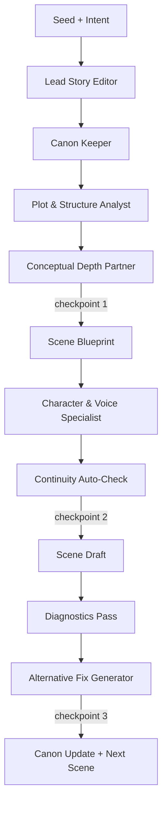
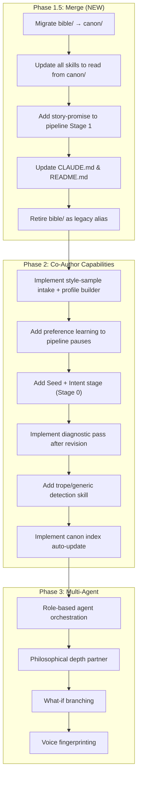

# Post-PR Merge Evaluation: New Files Analysis

## What Was Merged

The latest commit (`a5b28e8`) added the following files to the repository:

### New Documentation
| File | Purpose |
|------|---------|
| [05_AI_COAUTHOR_PLAN.md](file:///c:/Users/david/OneDrive/G-drive/K-D/Claude-Writing-Skills/05_AI_COAUTHOR_PLAN.md) | Multi-agent AI co-author architecture for SF-Thriller/Philosophical fiction |
| [06_COAUTHOR_EXECUTION_RUNBOOK.md](file:///c:/Users/david/OneDrive/G-drive/K-D/Claude-Writing-Skills/06_COAUTHOR_EXECUTION_RUNBOOK.md) | Operational runbook for canon setup + validation |
| [07_COAUTHOR_SYSTEM_DESIGN.md](file:///c:/Users/david/OneDrive/G-drive/K-D/Claude-Writing-Skills/07_COAUTHOR_SYSTEM_DESIGN.md) | End-to-end system design with Mermaid flow diagram |

### New Structural Files
| File/Dir | Purpose |
|----------|---------|
| `canon/index.md` | Canonical registry for the co-author system |
| `canon/timeline.md` | Event ordering for continuity (stub) |
| `canon/preferences.md` | User preference tracking (stub) |
| `canon/characters/`, `world/`, `tech/`, `themes/`, `style-samples/` | Modular knowledge base directories (empty) |
| `scripts/validate_coauthor_setup.py` | Deterministic validator for canon structure |
| `.claude/skills/story-promise/SKILL.md` | New skill: define the story's narrative promise |

### Migrated/Modified Files
| Change | File |
|--------|------|
| **Deleted** | `.claude/commands/skills/ai-filter-humanize.md`, `scene-draft.md`, `voice-anchor.md` |
| **Added** | `.claude/skills/ai-filter-humanize/SKILL.md`, `scene-draft/SKILL.md`, `voice-anchor/SKILL.md` (upgraded format with YAML frontmatter) |
| **Added** | `.claude/commands/pipeline-run.md` (3-stage orchestrator referencing all 12 skills) |
| **Added** | `bible/scene-tracker.md`, 4 templates in `templates/` |
| **Modified** | `CLAUDE.md`, `README.md` |

---

## Two Systems — Same Problem, Different Philosophy

The repository now contains **two parallel design visions** for AI-assisted fiction writing:

### System A: MVP Pipeline (Docs 01–04)

- **Philosophy**: Skill-based, human-driven pipeline. Writer invokes individual skills in sequence. AI is a **tool**.
- **Identity model**: Writer's `bible/` is source of truth — flat structure with `story-bible.md`, `world-rules.md`, `scene-tracker.md`.
- **Skills**: 12 discrete skills in `.claude/skills/`, each a focused craft operation.
- **Pipeline**: 3-stage `pipeline-run.md` orchestrator with pause-for-review.
- **Roadmap**: Phase 1 (MVP) → Phase 2 (agents/depth) → Phase 3 (scale).

### System B: AI Co-Author (Docs 05–07)

- **Philosophy**: Multi-agent, opinionated co-author. AI **proposes direction** and the writer approves. AI is a **partner**.
- **Identity model**: `canon/` is source of truth — modular knowledge base with index, timeline, preferences, domain-scoped subfolders, and style-samples.
- **Roles**: 6 specialized agents (Lead Editor, Plot Analyst, Character Specialist, Canon Keeper, Conceptual Depth Partner, Prose Crafter).
- **Pipeline**: 6-stage workflow (Seed → Canon → Architecture → Blueprint → Draft → Diagnostics).
- **Unique features**: Style modeling from user samples, preference learning loop, "what-if" branching, trope detection, philosophical depth analysis.

---

## Are They Compatible?

**Partially.** They share the same skill definitions and the same fundamental goal, but they diverge on:

| Dimension | System A (MVP Pipeline) | System B (Co-Author) |
|-----------|------------------------|---------------------|
| **Source of truth** | `bible/` (3 flat files) | `canon/` (modular index + subfolders) |
| **AI role** | Passive tool | Active partner |
| **Workflow entry** | Writer provides scene idea | AI generates trajectory options |
| **Stages** | 3 (plan → draft → revise) | 6 (seed → canon → plot → blueprint → draft → diagnostics) |
| **Preference tracking** | None | `canon/preferences.md` + learning loop |
| **Style modeling** | "Watcher voice" hardcoded in skills | User-supplied style samples analyzed first |
| **Validation** | Quality checks inside skills | Python validator script + per-stage auto-checks |
| **Canon management** | Manual | Canon Keeper agent + explicit change log |

---

## What Capability Has Been Lost?

> [!IMPORTANT]
> **Nothing critical was lost**, but fragmentation creates confusion.

The 3 deleted command-style skill files (`ai-filter-humanize.md`, `scene-draft.md`, `voice-anchor.md`) were **replaced** by richer SKILL.md versions — this is a net upgrade.

However, System B introduced capabilities that **exist only in documentation** and have no implementation:

| Capability | Status |
|------------|--------|
| Style modeling from user samples | Described in docs; `style-samples/` directory exists but is empty; no skill implements it |
| Preference learning loop | `preferences.md` is a stub; no skill reads or writes it |
| Multi-agent orchestration (6 roles) | Described in 05/07; no command or skill implements these roles |
| Trope/generic detection | Described in 05; partially covered by `ai-filter-humanize` skill |
| Philosophical depth analysis | Described in 05; no skill implements it |
| "What-if" branching | Described in 05; no implementation |
| `canon/index.md` as registry | Exists but is not referenced by any skill or pipeline |
| `validate_coauthor_setup.py` | Works, but validates `canon/` structure that no skill actually uses |

Meanwhile, the **existing skills reference `bible/` paths** (e.g., `scene-draft` Step 1: "Load and verify against World Rules hard constraints"), not `canon/` paths. This means the two source-of-truth systems are disconnected.

---

## Recommendation: Combine Them

> [!TIP]
> **Yes, combine.** The co-author docs represent the natural evolution of the MVP pipeline — they're what Phase 2+ *should* become. Keeping them separate creates confusion and duplicated truth-tracking.

### Why Combine

1. **Skills are shared.** Both systems use the same 12 skills. The co-author docs just add upstream stages (Seed, Canon, Plot) and downstream stages (Diagnostics, Alternatives) — these are pipeline extensions, not replacements.
2. **Canon is bible+.** The `canon/` structure is a strict superset of `bible/`. Canon adds: index registry, timeline, preferences, style-samples, and domain-scoped subfolders (`tech/`, `themes/`). Bible's 3 files map directly into canon modules.
3. **The roadmap already predicted this.** Phase 2 of `01_PRODUCT_ROADMAP.md` explicitly calls for Scene Director Agent, Prose Surgeon, Dialogue Subtext, Tension Curve, AI Humanization, and Continuity Keeper — all of which appear in the co-author docs.

### How to Combine — Revised Roadmap

### Specific Changes

#### Phase 1.5: Merge Sprint (1–2 weeks)

| Task | Detail |
|------|--------|
| **Migrate `bible/` → `canon/`** | Move `story-bible.md` → `canon/world/story-bible.md`, `world-rules.md` → `canon/world/world-rules.md`, `scene-tracker.md` → `canon/timeline.md` (merge with existing stub). Keep `bible/` as symlinks for backward compat. |
| **Update all 12 skills** | Change hard-coded `bible/` paths to `canon/` paths. Add `canon/index.md` read to context-loading steps. |
| **Extend pipeline-run.md** | Add `story-promise` to Stage 1 (before `chapter-promise`). Add a new Stage 0 for seed/intent (optional). Add a Stage 4 for diagnostics (optional). |
| **Update CLAUDE.md** | Replace `bible/` references with `canon/`. Document both flat and modular usage patterns. |
| **Update validate script** | Extend `validate_coauthor_setup.py` to also check skill presence and pipeline-run integrity. Rename to `validate_setup.py`. |

#### Phase 2: Co-Author Features (fold into existing Phase 2)

- Style modeling from `canon/style-samples/`
- Preference learning at pipeline pause points
- Trope/generic detection as a new skill
- Canon auto-update after scene completion
- Diagnostic summary + alternative suggestions stage

#### Phase 3: Multi-Agent (fold into existing Phase 3)

- Agent roles from doc 05 become the orchestration layer
- Philosophical depth partner becomes a skill or agent
- "What-if" branching as an on-demand mode

---

## Summary

The new files represent a **well-designed architectural vision** (co-author as collaborative partner) that naturally extends the existing MVP pipeline (co-author as tool). They are **not intended to be separate** — they're the next evolution. But the PR merged them as documentation + stubs without wiring them into the existing skills or pipeline, creating a split-brain situation.

**My recommendation**: Do a focused "Phase 1.5" merge sprint to unify the source-of-truth (`canon/` absorbs `bible/`), update all skills to reference the unified location, and fold the co-author roadmap into the existing phased plan. This preserves everything from both systems while eliminating confusion.
